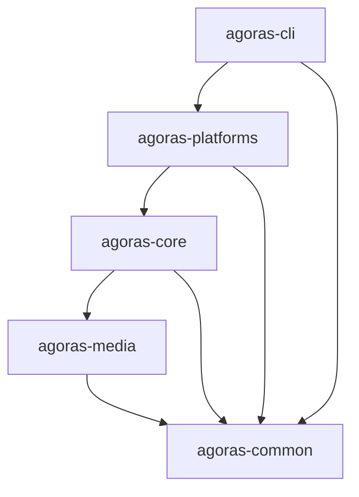

# Agoras Package Split Plan (True Split)

This plan details the strategy to divide the monolithic `agoras` package into 5 independent, distributable PyPI packages using a Layered Architecture.

## Objectives

- **Decoupling**: Isolate components to minimize circular dependencies.
- **Modularity**: Allow users/developers to install only specific parts (e.g., just the media handler or just the core interfaces).
- **Maintainability**: Clearer boundaries between Infrastructure, Logic, and Interfaces.

## 1. Package Architecture & Dependency Graph

The packages are organized in layers. Higher layers depend on lower layers.



| Package Name | PyPI Name (Proposed) | Namespace | Purpose | Dependencies |
| :--- | :--- | :--- | :--- | :--- |
| **Common** | `agoras-common` | `agoras.common` | Low-level utilities, logging, shared constants. | None |
| **Media** | `agoras-media` | `agoras.media` | Image and Video processing logic. | `agoras-common` |
| **Core** | `agoras-core` | `agoras.core` | Interfaces (`SocialNetwork`), Generic Logic (`Feed`, `Sheet`), Base API/Auth classes. | `agoras-common`, `agoras-media` |
| **Platforms** | `agoras-platforms` | `agoras.platforms` | Concrete API clients and `SocialNetwork` implementations. | `agoras-core` |
| **CLI** | `agoras` (or `agoras-cli`) | `agoras.cli` | Command Line Interface and entry point. | `agoras-platforms` |

*> Note: The main user-facing tool will likely retain the package name `agoras` on PyPI (containing the CLI), or `agoras-cli` if you prefer explicit naming.*

## 2. Detailed File Mapping

### 1. `agoras-common`

**Root**: `src/agoras/common`
**Description**: Pure python utilities with minimal external dependencies.

| Current File | New Location | Notes |
| :--- | :--- | :--- |
| `agoras/core/utils.py` | `agoras/common/utils.py` | Generic helper functions. |
| `agoras/core/logger.py` | `agoras/common/logger.py` | Logging configuration. |
| `agoras/__init__.py` | `agoras/common/version.py` | Version info, Author metadata (shared source of truth). |

### 2. `agoras-media`

**Root**: `src/agoras/media`
**Description**: Heavy media processing.

| Current File | New Location | Notes |
| :--- | :--- | :--- |
| `agoras/core/media/__init__.py` | `agoras/media/__init__.py` | |
| `agoras/core/media/base.py` | `agoras/media/base.py` | Base Media classes. |
| `agoras/core/media/image.py` | `agoras/media/image.py` | Image processing. |
| `agoras/core/media/video.py` | `agoras/media/video.py` | Video processing. |
| `agoras/core/media/factory.py` | `agoras/media/factory.py` | Factory pattern. |

### 3. `agoras-core`

**Root**: `src/agoras/core`
**Description**: The framework logic. Defines *how* things work abstractly.

| Current File | New Location | Notes |
| :--- | :--- | :--- |
| `agoras/core/base.py` | `agoras/core/interfaces.py` | `SocialNetwork` abstract class. |
| `agoras/core/api/base.py` | `agoras/core/api_base.py` | `BaseAPI` class. |
| `agoras/core/api/auth/base.py` | `agoras/core/auth/base.py` | `BaseAuthManager`. |
| `agoras/core/api/auth/storage.py`| `agoras/core/auth/storage.py`| Token storage logic. |
| `agoras/core/api/auth/exceptions.py`| `agoras/core/auth/exceptions.py`| Auth exceptions. |
| `agoras/core/api/auth/callback_server.py`| `agoras/core/auth/callback_server.py`| OAuth Callback Server. |
| `agoras/core/feed/*` | `agoras/core/feed/*` | Feed Logic. |
| `agoras/core/sheet/*` | `agoras/core/sheet/*` | Google Sheets Logic. |

### 4. `agoras-platforms`

**Root**: `src/agoras/platforms`
**Description**: The "drivers". Concrete implementations.

| Current File | New Location | Notes |
| :--- | :--- | :--- |
| **Wrapper Layer** | | |
| `agoras/core/<platform>.py` | `agoras/platforms/<platform>/wrapper.py` | e.g. `facebook.py`, `telegram.py`, `x.py`. |
| **API Manager Layer** | | |
| `agoras/core/api/<platform>.py` | `agoras/platforms/<platform>/api.py` | High-level API manager. |
| **Client Layer** | | |
| `agoras/core/api/clients/<platform>.py` | `agoras/platforms/<platform>/client.py` | Low-level HTTP client. |
| **Auth Layer** | | |
| `agoras/core/api/auth/<platform>.py` | `agoras/platforms/<platform>/auth.py` | Platform-specific auth logic. |

*Platforms to migrate*: `discord`, `facebook`, `instagram`, `linkedin`, `telegram`, `threads`, `tiktok`, `twitter` (legacy), `whatsapp`, `x`, `youtube`.

### 5. `agoras-cli` (The Main Package)

**Root**: `src/agoras/cli`
**Description**: The executable.

| Current File | New Location | Notes |
| :--- | :--- | :--- |
| `agoras/cli.py` | `agoras/cli/main.py` | Entry point. |
| `agoras/cli/*` | `agoras/cli/*` | All CLI logic. |
| `agoras/commands/*` | `agoras/cli/commands/*` | Command implementations. |

## 3. Code Separation Strategy

### Current State

- **Version**: `v1.1.3` (monolithic)
- **Repository**: Single codebase on `main` branch
- **Users**: Expect stable API and import paths

### Strategy: Clean Break with Grace Period

This migration follows a clean break approach where v2.x will be architecturally different from v1.x, with a grace period for users to migrate.

#### Branch Strategy

1. **Tag Current State**: `git tag v1.1.3-final`
2. **Create Development Branch**: `git checkout -b v2-dev`
3. **All v2 work happens on `v2-dev`**
4. **Critical v1.x patches**: Cherry-pick to `v1-maintenance` branch if needed

#### Versioning Strategy

- **v1.1.3**: Final monolithic release (security patches only)
- **v2.0.0-alpha**: First split package release (TestPyPI)
- **v2.0.0**: Production-ready split packages (PyPI)

#### PyPI Strategy

- `agoras==1.1.3`: Remains available indefinitely
- `agoras==2.0.0`: New CLI package (depends on 4 sub-packages)
- Users must explicitly upgrade: `pip install agoras>=2.0.0`
- Document breaking changes prominently in release notes

#### Migration Path for Users

1. **Before v2**: Users run `pip install agoras` → gets v1.1.3
2. **After v2 release**: Users run `pip install agoras` → gets v1.1.3 (pin max version)
3. **Explicit upgrade**: Users run `pip install "agoras>=2.0.0"` → gets v2.0.0
4. **Imports break**: Old `from agoras.core import Facebook` → becomes `from agoras.platforms.facebook import Facebook`

#### Documentation Requirements

- `MIGRATION.md`: Step-by-step guide for v1 → v2
- `CHANGELOG.md`: Comprehensive breaking changes list
- `README.md`: Prominent notice about v2 architecture
- Update docs site with v1 vs v2 comparison

### Migration Timeline

1. **Week -1 (Before Migration)**:
   - Tag `v1.1.3-final` on `main`
   - Create `v2-dev` branch for all split work
   - Add deprecation notice to v1.1.3 README (optional v1.1.4 release)

2. **Weeks 1-4 (During Migration)**: Work on `v2-dev` branch

3. **Week 5 (Post-Migration)**:
   - Merge `v2-dev` → `main`
   - Tag `v2.0.0-alpha`
   - Publish to TestPyPI
   - Collect feedback

4. **Week 6-8 (Stabilization)**:
   - Fix issues found in alpha
   - Tag `v2.0.0`
   - Publish to PyPI
   - Create `v1-maintenance` branch (frozen, emergency patches only)

### Breaking Changes to Document

| v1.x Import | v2.x Import | Notes |
| :--- | :--- | :--- |
| `from agoras.core import Facebook` | `from agoras.platforms.facebook import Facebook` | Platform wrappers moved |
| `from agoras.core.media import MediaFactory` | `from agoras.media import MediaFactory` | Media is now separate |
| `from agoras.core.feed import Feed` | `from agoras.core.feed import Feed` | Feed stays in core (works) |
| `from agoras.core.logger import setup_logger` | `from agoras.common.logger import setup_logger` | Logger moved to common |

## 4. Implementation Plan (Week-by-Week)

### Phase 0: Pre-Migration (Week -1)

**Goal**: Prepare repository for major architectural change.

1. **Day 1: Version Control Preparation**
   - Tag current state: `git tag v1.1.3-final && git push --tags`
   - Create development branch: `git checkout -b v2-dev`
   - Document current import paths (for migration guide)

2. **Day 2: Communication & Planning**
   - Draft `MIGRATION.md` skeleton
   - Create GitHub Issue announcing v2 architecture change
   - Pin issue for visibility

3. **Day 3: Baseline Tests**
   - Run full test suite and document current coverage
   - Capture baseline performance metrics
   - Document all current entry points

4. **Day 4-5: Repository Structure Planning**
   - Create `packages/` directory structure
   - Set up shared development tools (tox, nox, pre-commit)
   - Prepare CI/CD pipeline changes

### Week 1: Foundation & Low-Level Components

**Goal**: Establish the monorepo structure and extract independent utilities.

1. **Day 1: Monorepo Setup**
    - Create top-level directory structure: `packages/common`, `packages/media`, `packages/core`, `packages/platforms`, `packages/cli`.
    - Initialize `git` handling (decide if using submodules or just folders).
    - Set up root-level `dev-requirements.txt` or toolchain (e.g., `tox`, `nox`) for running tests across all packages.

2. **Day 2: `agoras-common`**
    - Extract `agoras/core/utils.py` and `agoras/core/logger.py` to `packages/common/src/agoras/common/`.
    - Create `packages/common/setup.py`.
    - Write unit tests for `agoras-common` to ensure standalone functionality.

3. **Day 3: `agoras-media`**
    - Extract `agoras/core/media/` to `packages/media/src/agoras/media/`.
    - Update imports in media files to use `agoras.common`.
    - Add `agoras-common` as a dependency in `packages/media/setup.py`.

4. **Day 4-5: Verification & Testing**
    - Create a test environment installing both `agoras-common` and `agoras-media`.
    - Run existing media-related tests to verify nothing broke during extraction.

### Week 2: Core Logic & Interfaces

**Goal**: Define the abstract layer and migrate shared business logic.

1. **Day 1: `agoras-core` Interfaces**
    - Extract `agoras/core/base.py` (SocialNetwork interface) to `packages/core/src/agoras/core/interfaces.py`.
    - Extract `agoras/core/api/base.py` (BaseAPI) and all shared `agoras/core/api/auth/` files (base, storage, exceptions, callback_server) to `packages/core/src/agoras/core/`.

2. **Day 2: `agoras-core` Logic (Feed & Sheets)**
    - Move `agoras/core/feed/` and `agoras/core/sheet/` to `packages/core/src/agoras/core/`.
    - Refactor these modules to import from `agoras.common` and `agoras.media`.
    - Ensure strict dependency layering (Core -> Media -> Common).

3. **Day 3-4: `agoras-platforms` Setup**
    - Initialize `packages/platforms/src/agoras/platforms/`.
    - Move platform-specific files to their respective subdirectories (`facebook/`, `twitter/`, etc.).
    - **Refactor**: Update all imports to point to `agoras.core` for interfaces and base classes.

4. **Day 5: Platform Testing**
    - Verify that each platform implementation can still be instantiated and Mock-tested using the new structure.

### Week 3: CLI & Integration

**Goal**: Wire everything together and ensure the user experience remains unchanged.

1. **Day 1: `agoras-cli` Refactoring**
    - Move `agoras/cli/` to `packages/cli/src/agoras/cli/`.
    - Update `agoras/cli.py` entry point to import from the new package structure.
    - Update `setup.py` for CLI to depend on `agoras-platforms`.

2. **Day 2: Dependency Wiring**
    - Ensure `pip install .` in `packages/cli` correctly pulls in all 4 dependencies (`platforms`, `core`, `media`, `common`).
    - Fix any circular imports or namespace package issues that arise during integration.

3. **Day 3-5: End-to-End Testing**
    - Run the full test suite (`tox`).
    - Perform manual "smoke tests" for key commands (`post`, `schedule`, `authorize`).
    - Verify that `agoras --version` works and reports correctly.

### Week 4: Release & Documentation

**Goal**: Polish, document, and publish.

1. **Day 1: CI/CD Pipeline Update**
    - Update GitHub Actions (or other CI) to build and test 5 separate packages.
    - Create a release workflow that publishes all 5 packages to PyPI (or TestPyPI first).

2. **Day 2: Documentation**
    - Update `README.md` to explain the new modular structure.
    - Add "Advanced Installation" docs (e.g., "How to install only the Core").
    - Update Developer Guides (Contributing).

3. **Day 3-5: Final Polish & Release**
    - Freeze dependencies and version numbers (e.g., release v2.0.0-alpha).
    - Dry-run publish to TestPyPI.
    - **Go Live**: Publish to PyPI.

## 5. Example `setup.py` Configuration (Namespace Packages)

For `agoras-common`:

```python
# packages/common/setup.py
setup(
    name='agoras-common',
    packages=['agoras.common'],
    package_dir={'': 'src'},
    # ...
)
```

For `agoras-core`:

```python
# packages/core/setup.py
setup(
    name='agoras-core',
    packages=['agoras.core'],
    package_dir={'': 'src'},
    install_requires=[
        'agoras-common>=2.0.0',
        'agoras-media>=2.0.0'
    ],
    # ...
)
```

## 6. Potential Pitfalls & Mitigations

- **Circular Imports**: Strict layering prevents this. If `core` needs something from `platforms` (unlikely, but possible via factories), use dependency injection or dynamic loading.
- **Namespace Collisions**: Ensure every package uses the same `src/agoras` directory structure so they merge correctly when installed.
- **Development Friction**: Use `pip install -e .` for all 5 packages in your virtualenv during development to edit them simultaneously.
