Google credentials
==================

Creating JSON file with credentials to access Google Sheets API is fast
and easy. It can be summarized with the following steps.

#. Create a new project
#. Enable Google Drive API and Google Sheets API
#. Create Service Account credentials
#. Download JSON file with credentials

The schema showing the concept of how does it work.

|Authenticate Google Sheets with JSON credentials|

Create a new project
--------------------

Please open your Google Cloud console in your web browser. You can open
it by navigating the https://console.cloud.google.com/.

In this example, we will create a new project. It will store all details
about our connection to Google Sheets API. In my opinion, it is good to
have a separate project for accessing a Sheets, because in the case of
emergency it is easy to revoke the access.

If it is your first project then you will see the view similar like in
the image below:

|Create project|

If you already have some projects in your console, please click on
project in the top menu bar, and you will have dialog window with
``NEW PROJECT`` button.

|New project dialog|

The form for project creation will be displayed. Just set the name and
click ``CREATE``. In this example, I’ve used ``mljar-sheets-project`` as
a name. You can leave ``Location`` field empty.

|Fill project details|

After Project creation, you should see view like in the image below.
Please click ``ENABLE APIS AND SERVICES`` button to add access to
selected APIs.

|Google Cloud project after create|

Enable access to APIs in project
--------------------------------

In the next step, we will need to enable access to APIs for our project.
The project will need to have access to:

-  Google Drive API,
-  Google Sheets API

Why do we need to give additional access to Google Drive API? It’s
because Google Sheets are stored in Google Drive. Changes made on Sheets
are also changes on files in the Google Drive.

Let’s search for ``Google Drive API``:

|Search Google Drive API|

When you found it, just click ``ENABLE`` button:

|Enable Google Drive API|

After API is enabled, you will see the below view. Please click on
``APIs & Service`` in the left menu.

|Go back to APIs view|

We need to search one more API. Please enter ``Google Sheets API`` in
the search box:

|Search Google Sheets API|

Like before, please enable it with ``ENABLE`` button:

|Enable Google Sheets API|

Create Service Account credentials
----------------------------------

After enabling both (Drive and Sheets) APIs you will have the view like
in the image below. You can click there ``CREATE CREDENTIALS`` button.

|Create credentials (option 1)|

The other option for credentials creation is to go to the project
dashboard and click ``CREATE CREDENTIALS`` button there:

|Create credentials (option 2)|

You will have a menu displayed with several options. Please select
``Service account``.

|Create Service Account|

Service Account option will create a new account that we will use only
to access Google Sheets API. Google Cloud will create a new email
associated with Service Account. We will share selected Spreadsheets
with that email. Such solution is good and safe in my opinion. We have
an option to set a granular access to the resources that we want to
share with our script. In the case of stolen credentials, we simply
remove the credentials or even a whole project.

Please fill the Service account name and click ``CREATE AND CONTINE``.

|Create service account details 1|

In the next step, set access to the project. In this example, I set the
role to ``Owner``. You can set more restrictive role if needed. Click
``DONE`` button.

|Create service account details access 2|

Create JSON file with credentials
---------------------------------

After creating the Service Account you will see a view with your
credentials. Please click on your Service Account.

|Service Account created|

You will see its details. Please select ``KEYS`` tab.

|Service Account details|

In the ``KEYS`` view, just click ``ADD KEY`` and ``Create new key``:

|Service Account add key|

You will see a dialog where you can select the key format. Please select
JSON (should be the default) and click ``CREATE``. It should start
download of your JSON file with credentials.

|Go to APIs view|

Grab the JSON file and extract the values of the following keys: ``private_key``, ``client_email``

Agoras parameters
-----------------

+---------------------+------------------------------+
| Google credential   | Agoras parameter             |
+=====================+==============================+
| client_email        | --google-sheets-client-email |
+---------------------+------------------------------+
| private_key         | --google-sheets-private-key  |
+---------------------+------------------------------+

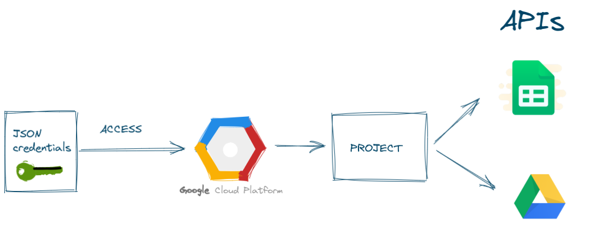
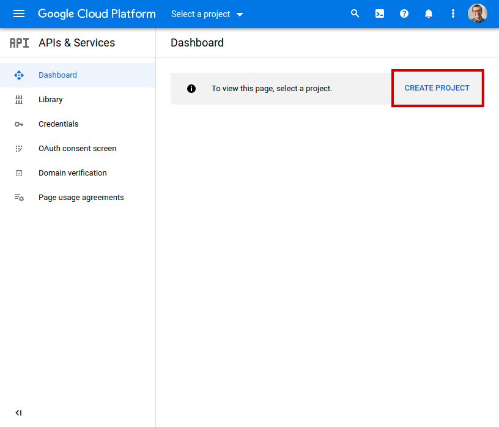
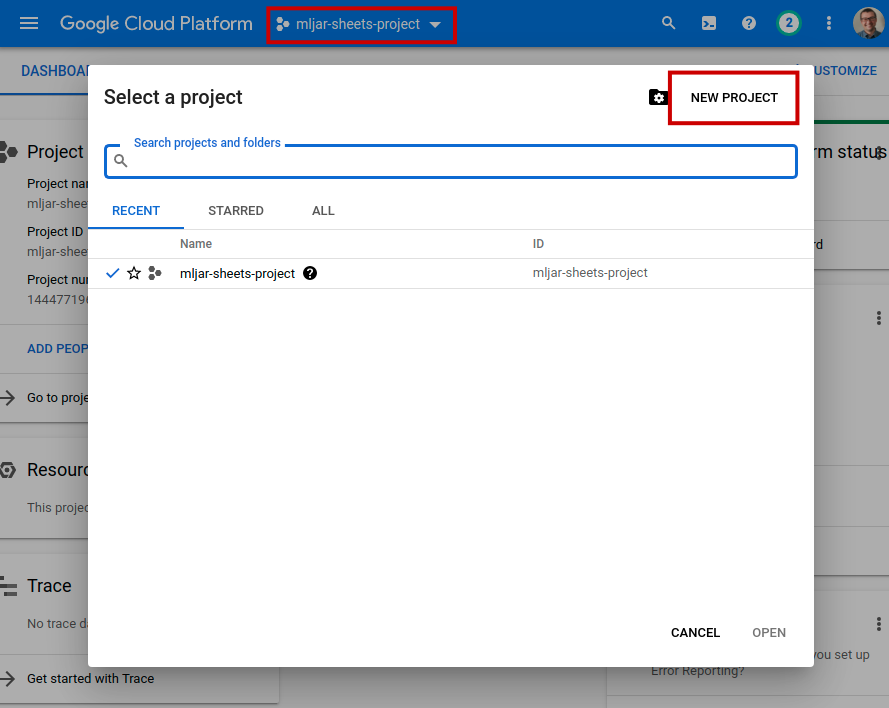
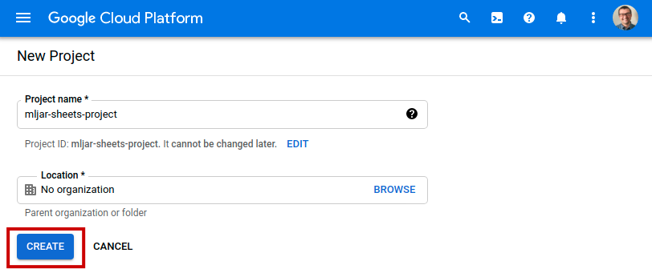
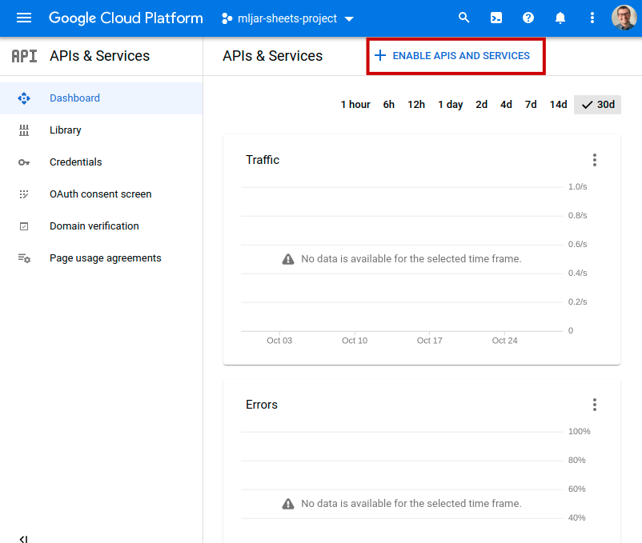
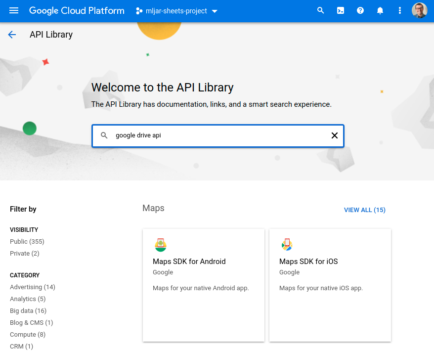
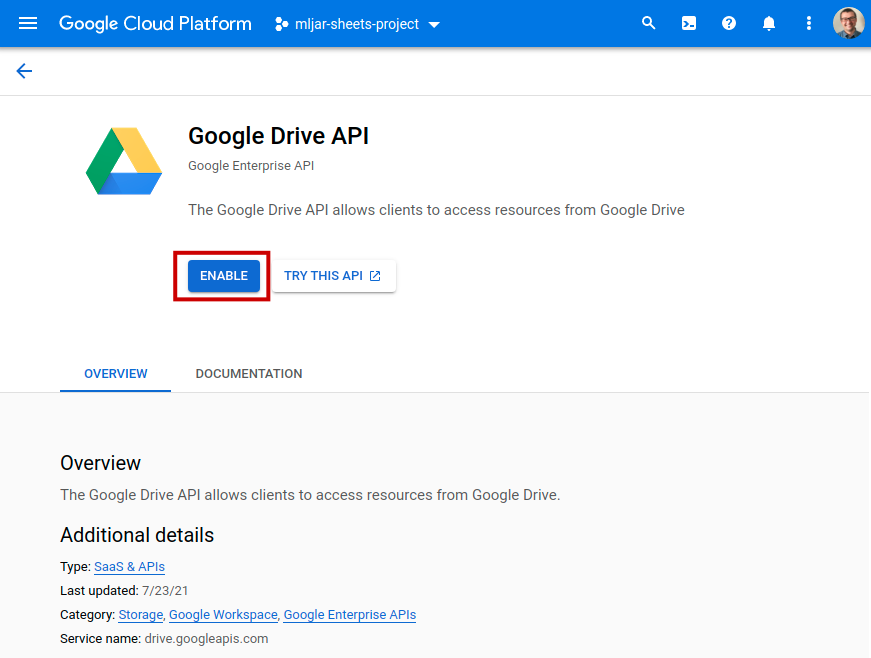
.. |Go back to APIs view| image:: images/go_back_to_apis.png
   :class: blog_img_border
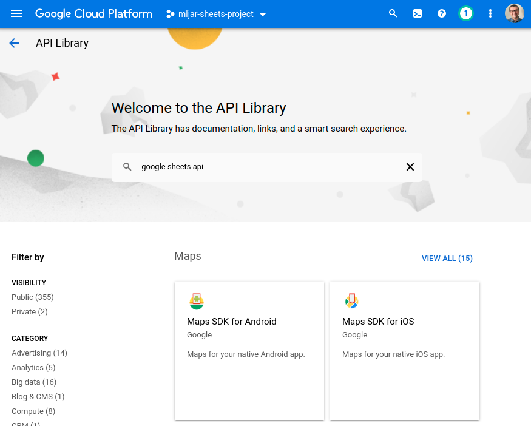
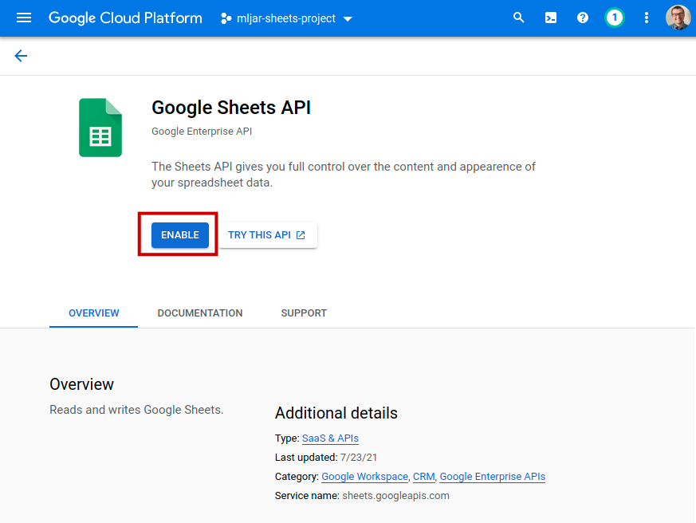
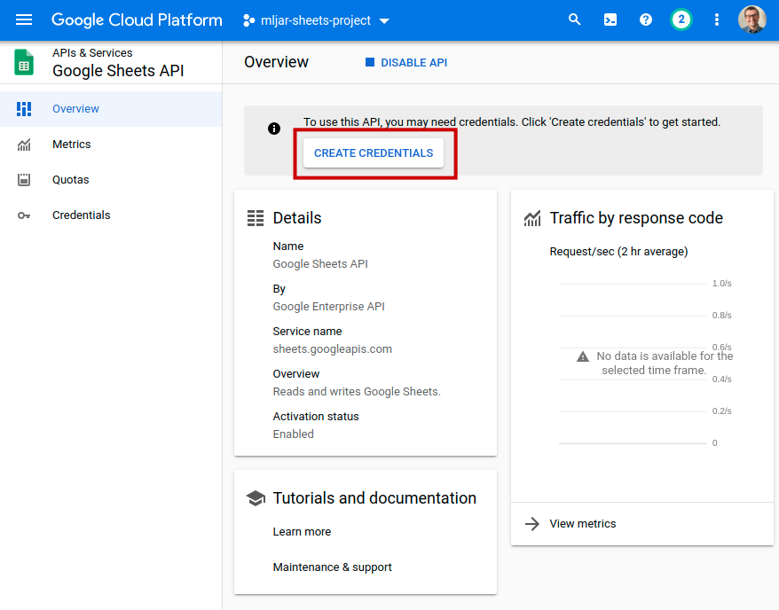
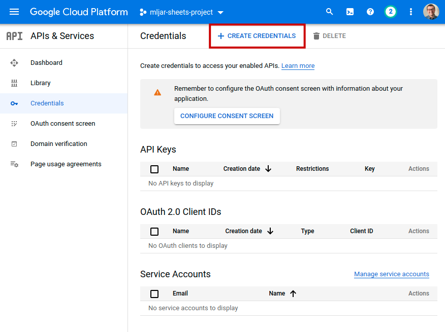
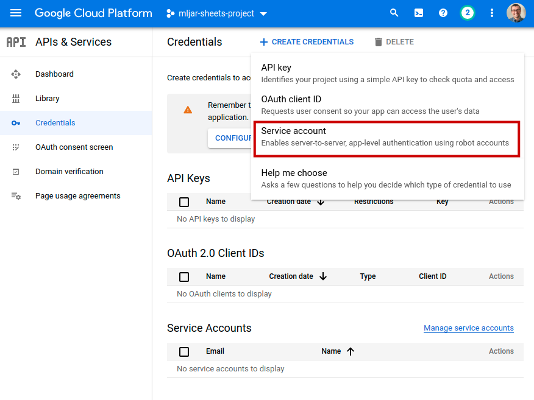
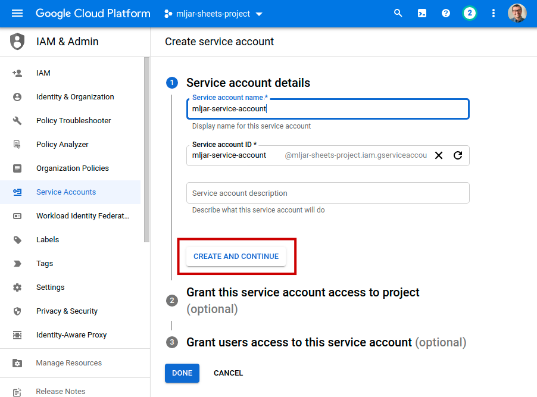
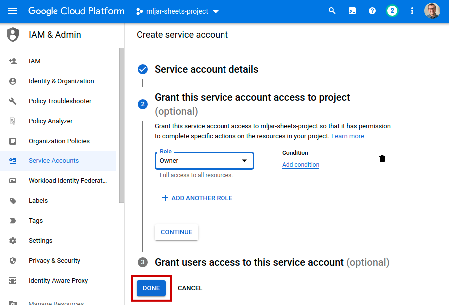
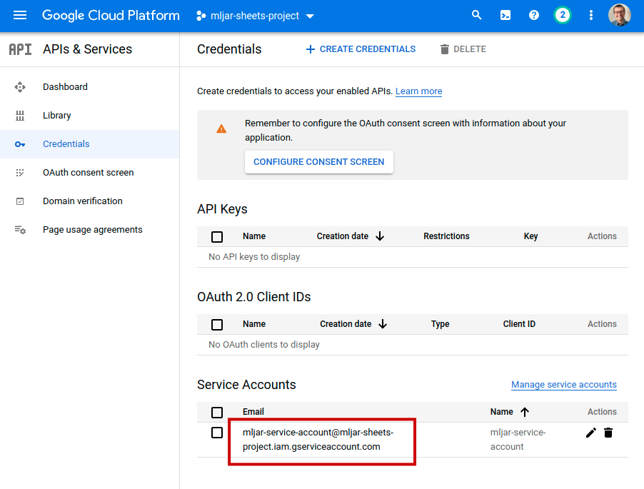
.. |Service Account details| image:: images/service_account_details.png
   :class: blog_img_border
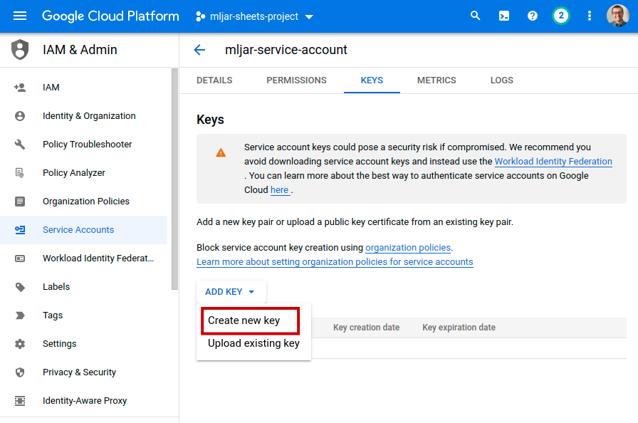
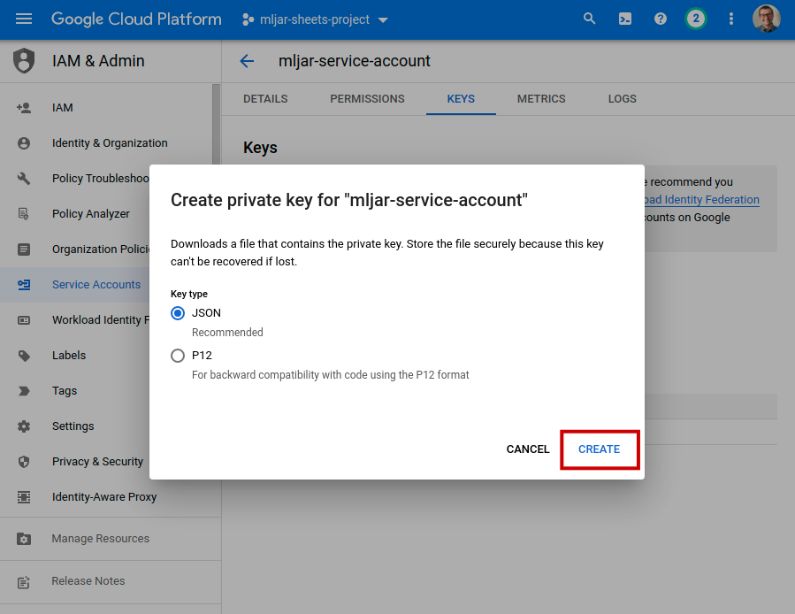
