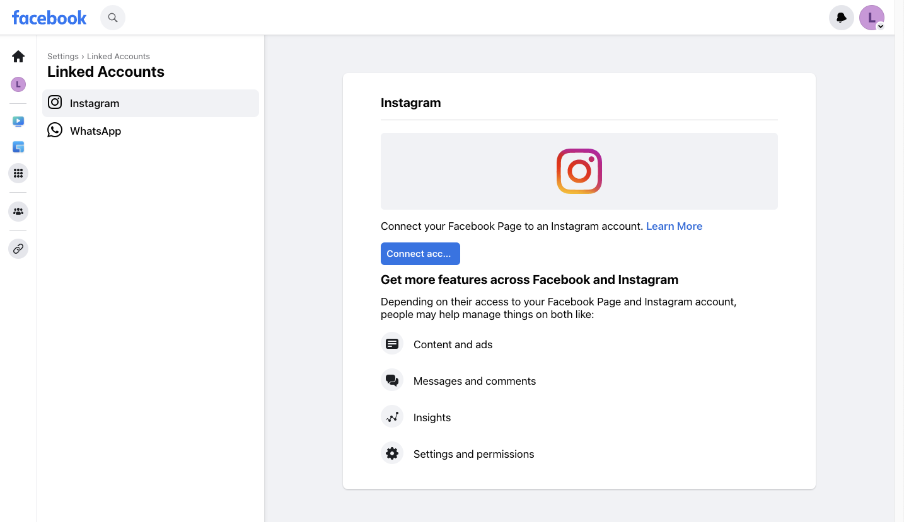
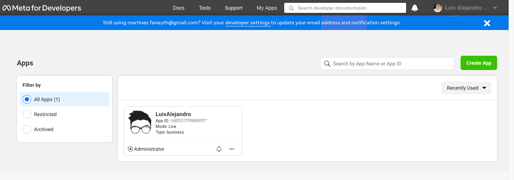
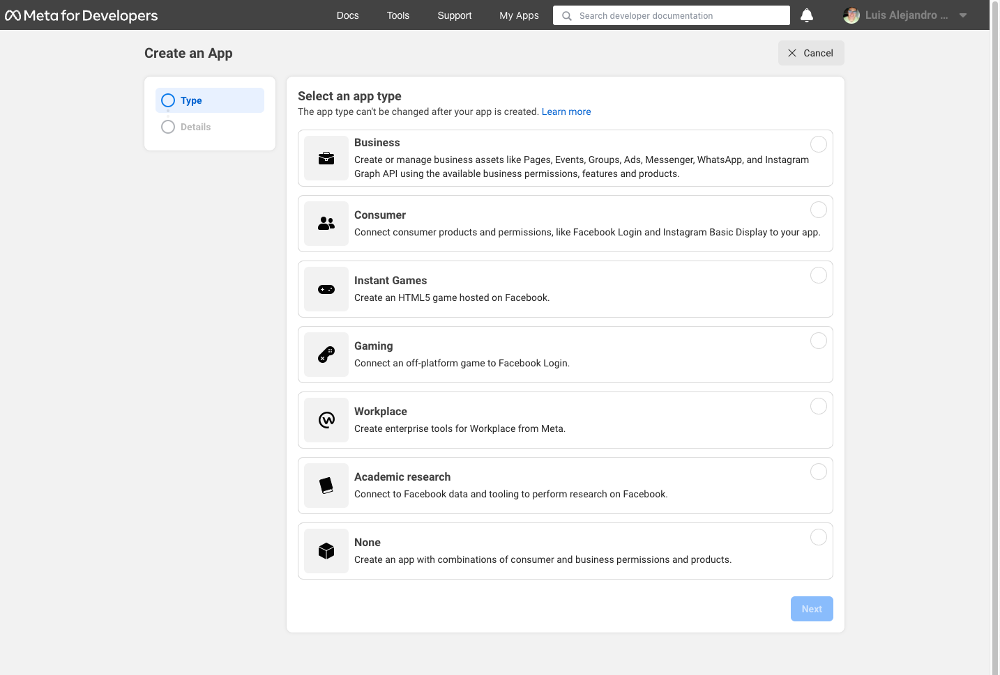
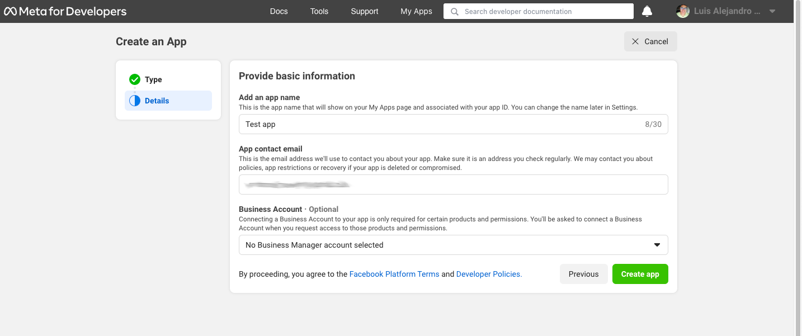
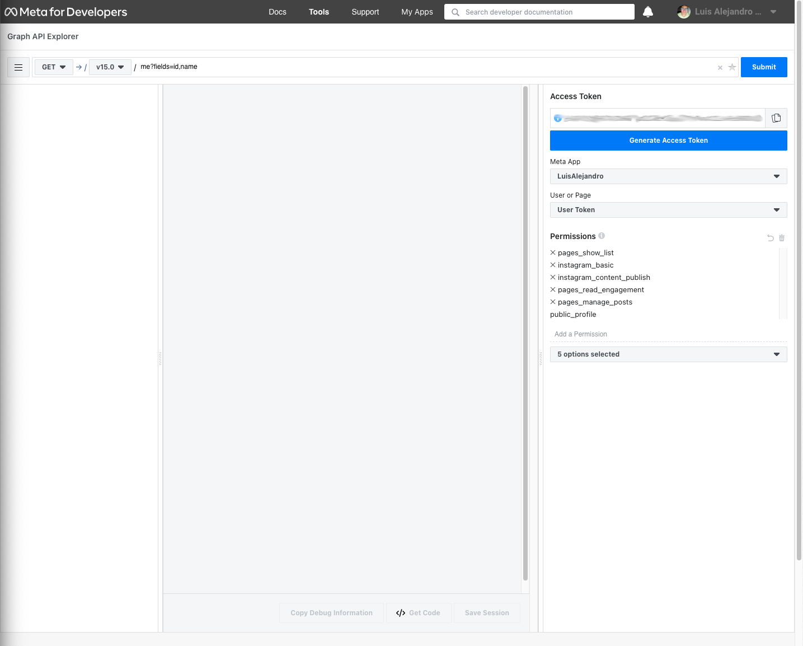
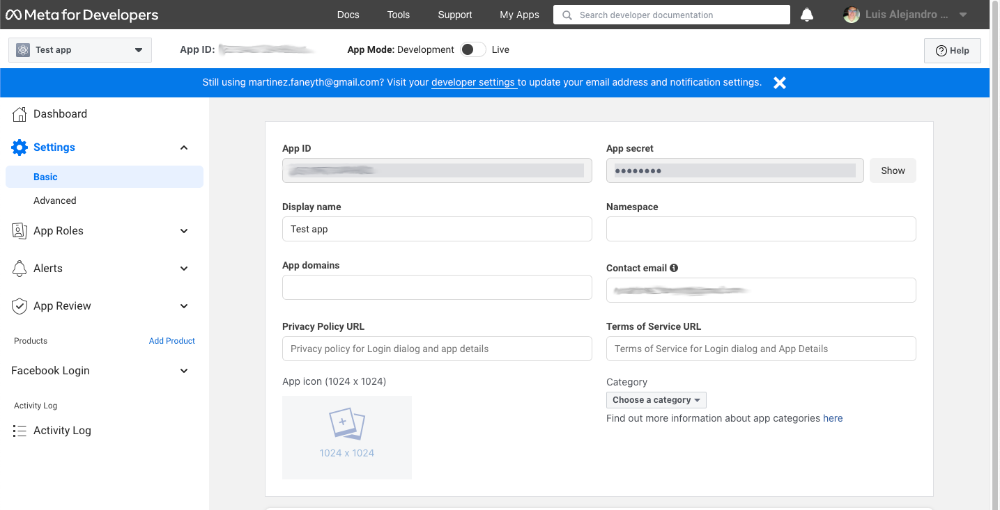

Instagram credentials
=====================

Agoras needs the following credentials from facebook to be able to access the Instagram Graph API.

- Access token
- Page ID

For that, we'll need to create a Facebook App.

Also, you need to connect a Facebook page with the Instagram account that you wish to use. For that, on Facebook, switch to the profile of the page thats going to manage the Instagram account, then click Settings & privacy > Settings > Linked Accounts and then click Connect.

How to get a Facebook permanent access token
~~~~~~~~~~~~~~~~~~~~~~~~~~~~~~~~~~~~~~~~~~~~

0. Create a Facebook App
------------------------

.. _My Apps: https://developers.facebook.com/apps/

**If you already have an app**, skip to step 1.

1. Go to `My Apps`_.
2. Click "Create App".
3. Setup a website app. This step will ask you to fill the type of app (select "None"), and then fill the app name.

You don't need to change its permissions or anything. You just need an app that wont go away before you're done with your access token.

1. Get User Short-Lived Access Token
------------------------------------

.. _Graph API Explorer: https://developers.facebook.com/tools/explorer

1. Go to the `Graph API Explorer`_.
2. Select the application you want to get the access token for (in the "Meta App" drop-down menu).
3. In the "Add a Permission" drop-down, search and check ``pages_show_list``, ``pages_read_user_content``, ``pages_read_engagement``, ``pages_manage_engagement``, ``instagram_basic`` and ``instagram_content_publish``.
4. Click "Generate Access Token".
5. Grant access from a Facebook account that has access to manage the page thats linked with the Instagram account. Note that if this user loses access the final, never-expiring access token will likely stop working.

The token that appears in the "Access Token" field is your short-lived access token. Take note of it.

2. Generate Long-Lived Access Token
-----------------------------------

.. _Access Token Debugger: https://developers.facebook.com/tools/debug/accesstoken

To get a long-lived access token (60 days), you'll need the short-lived access token from the previous step, your app ID and your app secret::

      https://graph.facebook.com/oauth/access_token?grant_type=fb_exchange_token&client_id={app_id}&client_secret={app_secret}&fb_exchange_token={short_lived_token}

You **cannot use the Graph API Explorer**. For some reason it gets stuck on this request. I think it's because the response isn't JSON, but a query string. Since it's a GET request, you can just go to the URL in your browser.

The response should look like this::

      {"access_token":"YYYYY","token_type":"bearer","expires_in":5183791}

"YYYYY" will be your long-lived access token. You can put it into the `Access Token Debugger`_ to verify. Under "Expires" it should have something like "2 months".

3. Get User ID
--------------

Using the long-lived access token, make a GET request to::

      https://graph.facebook.com/me?access_token={long_lived_access_token}

The response should look like this::

      {
            "name": "Luis Alejandro Mart\u00ednez Faneyth",
            "id": "XXXXX"
      }

The "XXXXX" field is your account ID. You'll need it for the next step.

4. Get Permanent Page Access Token
-----------------------------------

.. _Access Token Debugger: https://developers.facebook.com/tools/debug/accesstoken

Make a GET request to the following URL, you'll need the account ID from the previous step and the long-lived access token::

      https://graph.facebook.com/{account_id}/accounts?access_token={long_lived_access_token}

The JSON response should have a `data` field under which is an array of items the user has access to. Find the item for the page you want the permanent access token from. The `access_token` field should have your permanent access token. Copy it and test it in the `Access Token Debugger`_. Under "Expires" it should say "Never".

Agoras parameters
~~~~~~~~~~~~~~~~~

+------------------------------+--------------------------+
| Instagram credential         | Agoras parameter         |
+==============================+==========================+
| Permanent Page Access Token  | --instagram-access-token |
+------------------------------+--------------------------+
| Page ID                      | --instagram-object-id    |
+------------------------------+--------------------------+
