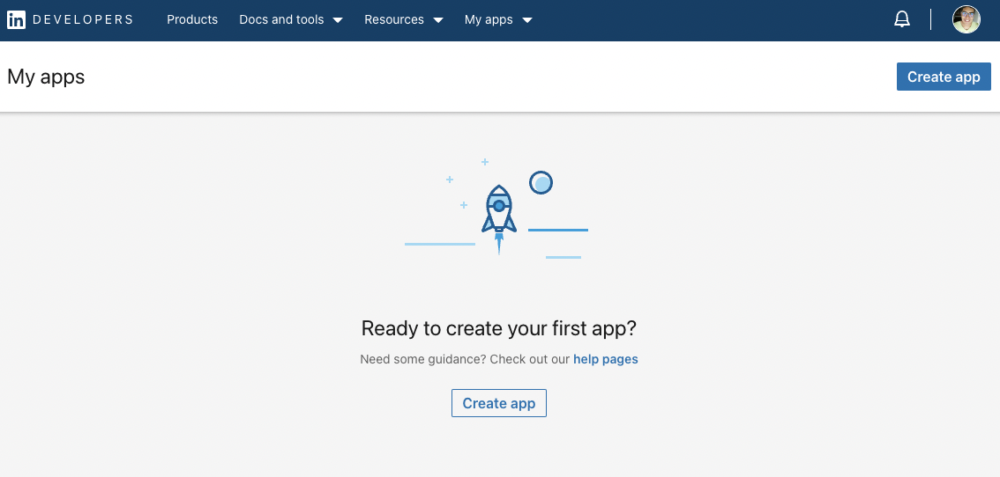
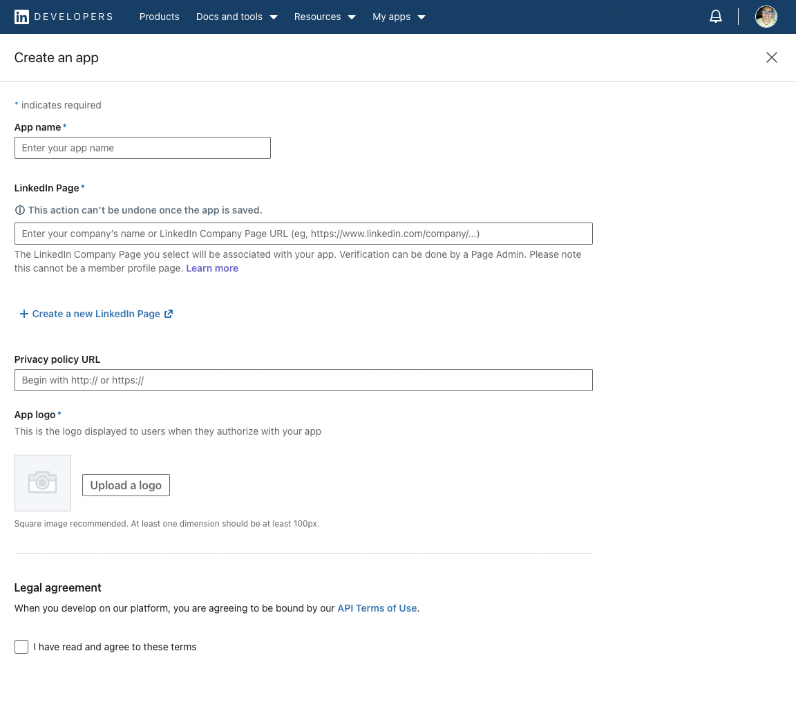
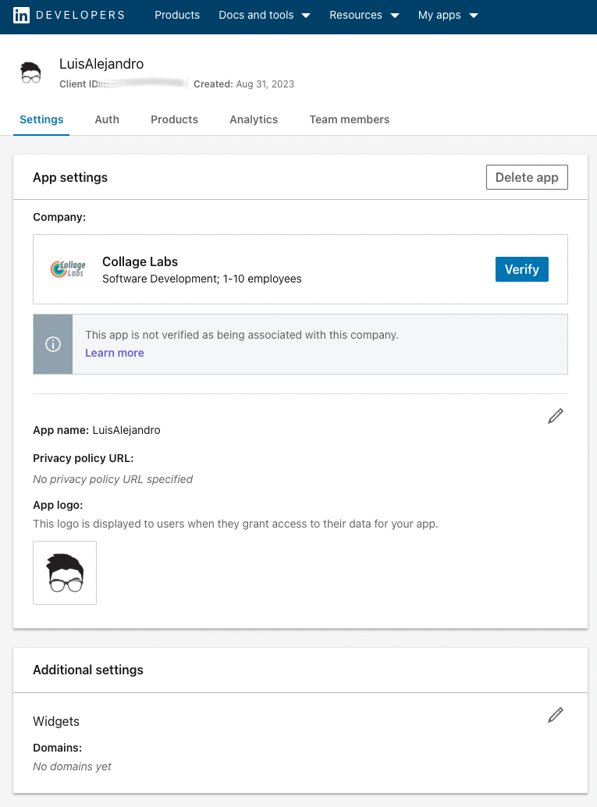
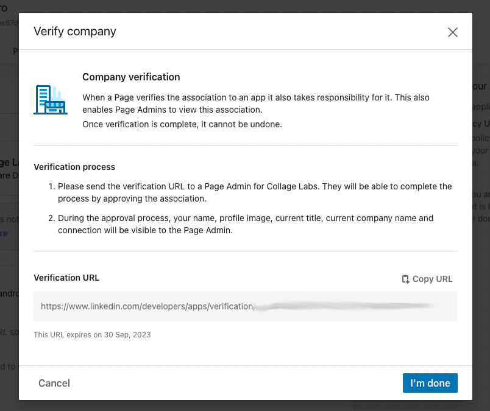
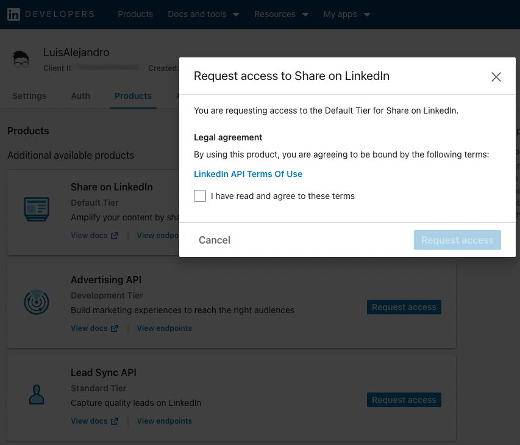
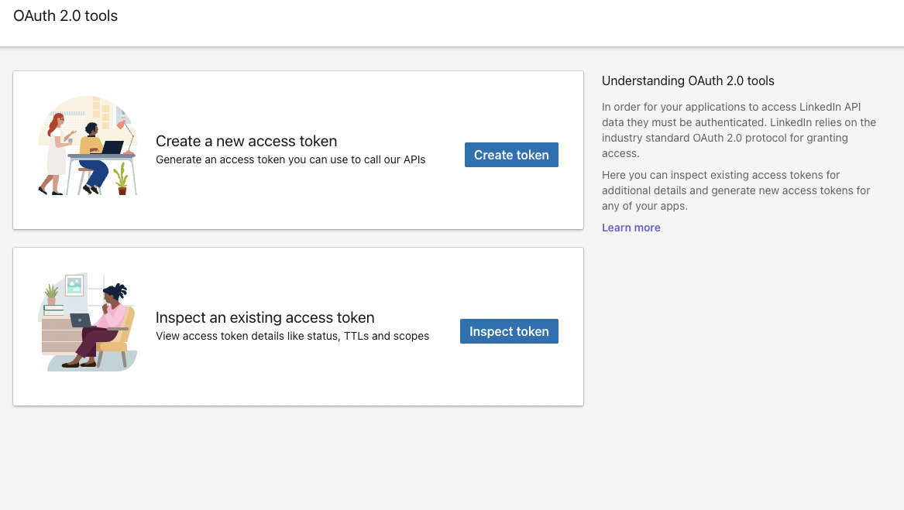
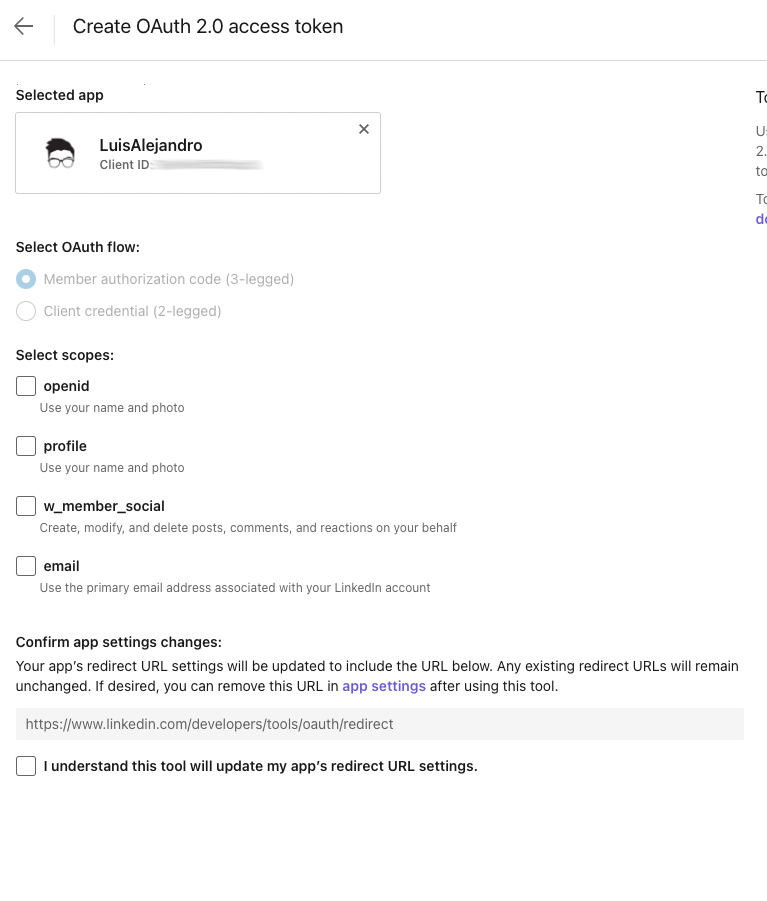
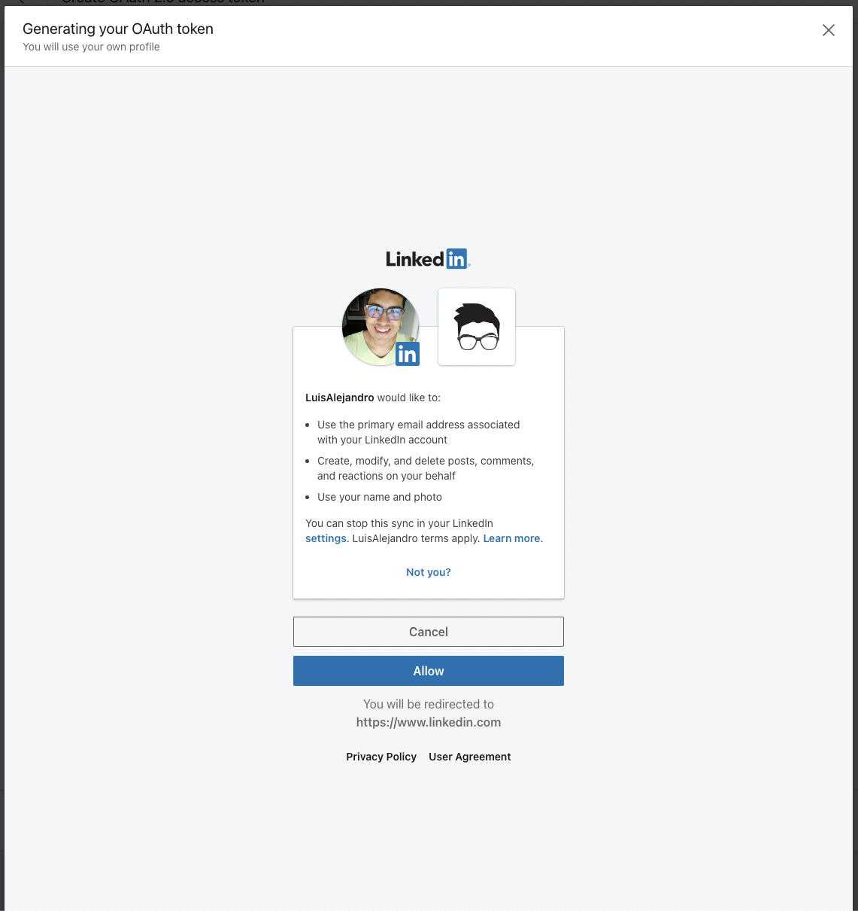
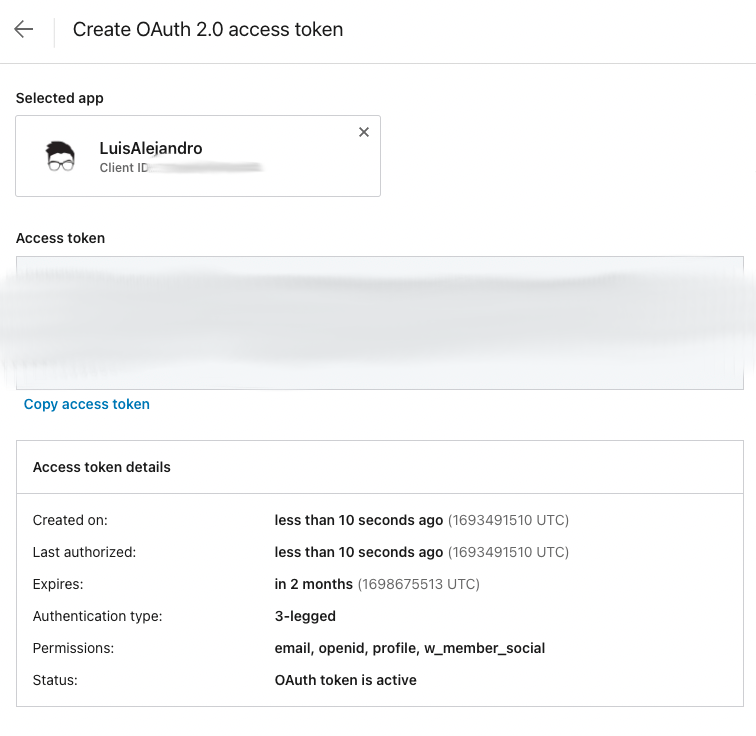

LinkedIn credentials
====================

Agoras needs an access token to be able to use the official LinkedIn API.

How to get a LinkedIn access token
~~~~~~~~~~~~~~~~~~~~~~~~~~~~~~~~~~

Create a LinkedIn App
---------------------

1. Sign in to the `LinkedIn developer portal <https://www.linkedin.com/developers/apps>`_.

2. Click "Create app" to create a new app.

3. Enter basic details such as the app's name and logo.

4. You will need to associate your app with a LinkedIn page. If you don't have any pages, `create one <https://www.linkedin.com/company/setup/new/>`_.

5. Request App Verification From the Company Page: go to the Settings tab and press the "Verify" button to receive a verification link. Open this link and confirm responsability for the app.

Request Access to products
--------------------------

1. Go to Products tab, and request access to "Share on LinkedIn" and "Sign In with LinkedIn using OpenID Connect".

2. Once approved (ussually instantly), go to the `OAuth tools <https://www.linkedin.com/developers/tools/oauth>`_ and create a new access token. You will need to select the app you created in the previous step. Select the "openid", "profile", "email" and "w_member_social" scopes. You can leave the redirect URL empty, we will not use it.

3. You will need to authorize the app to access your LinkedIn account. Click "Allow" to do so.

4. You will be redirected to a page with the access token. Copy it and save it somewhere safe, this is the access token we'll be needing to configure Agoras.

Agoras parameters
~~~~~~~~~~~~~~~~~

+---------------------+----------------------------+
| LinkedIn credential | Agoras parameter           |
+=====================+============================+
| Access Token        | --linkedin-access-token    |
+---------------------+----------------------------+
