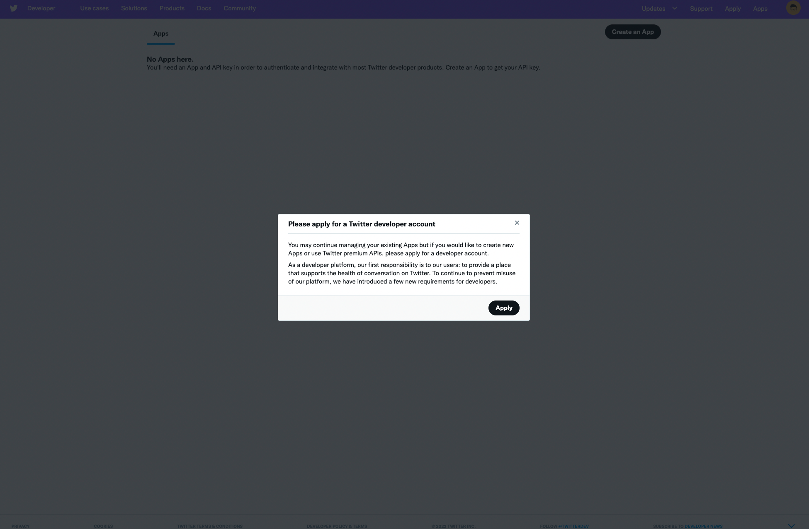
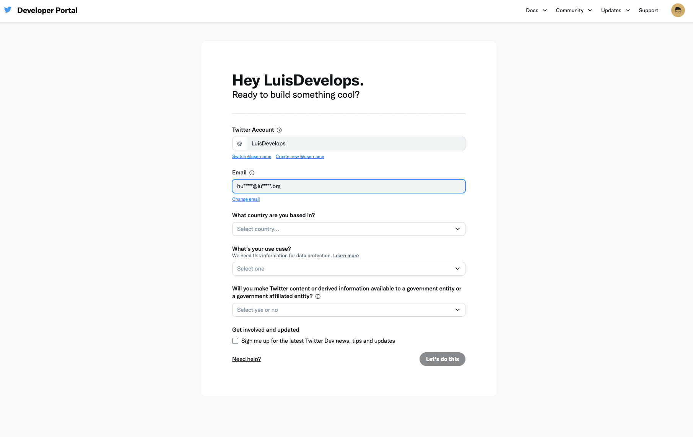
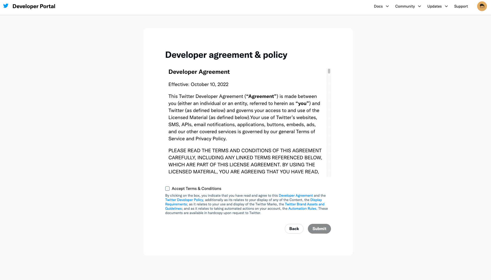
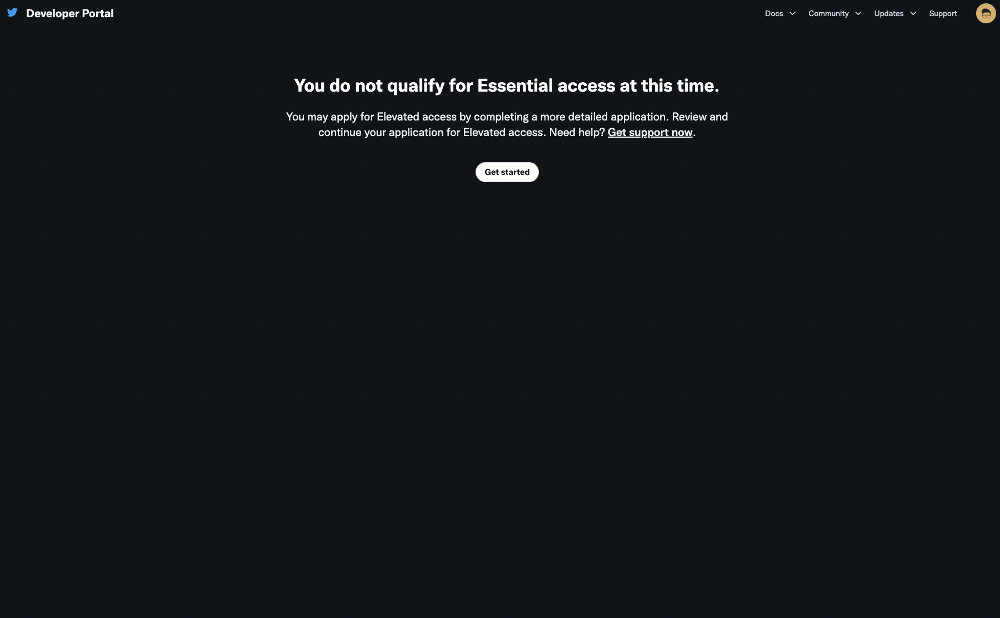
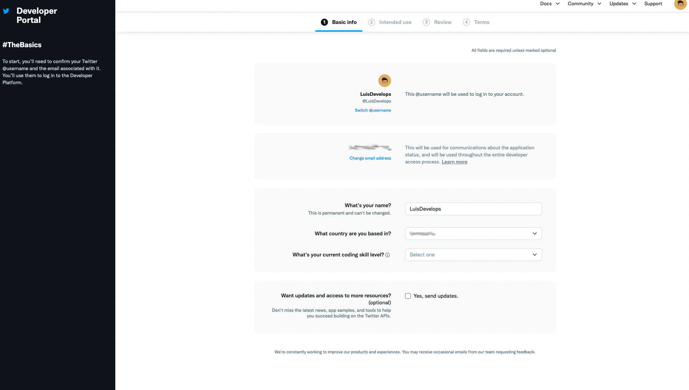
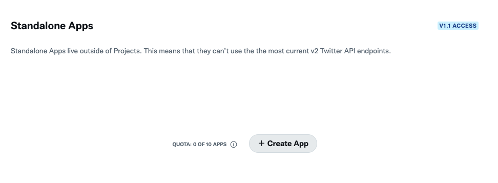
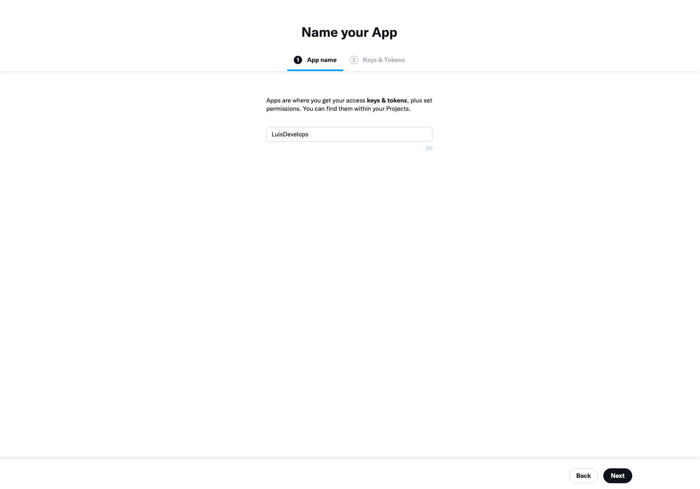
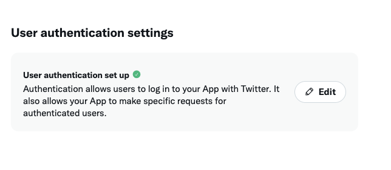
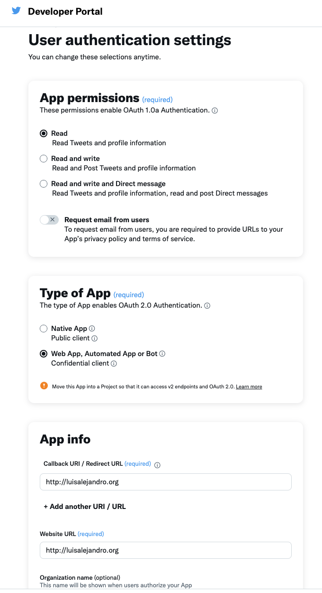
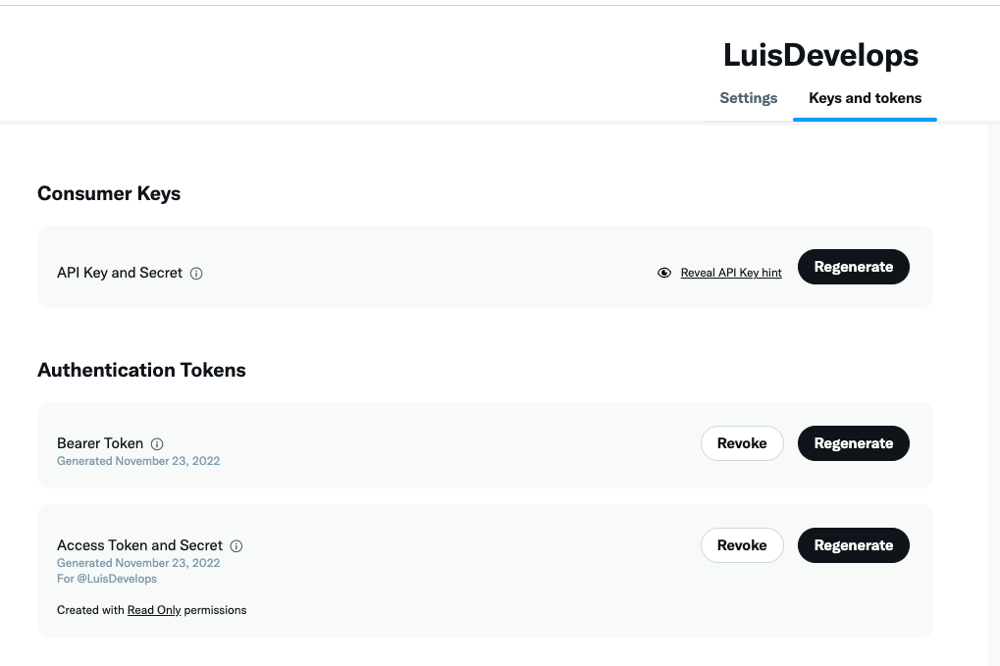

Twitter credentials
===================

Agoras needs the following credentials from twitter to be able to access its API.

- API key
- API secret key
- Access token
- Access token secret

For that, we'll need to create a Twitter App.

**Important**: Twitter now requires a paid subscription for certain parts of the API. The free tier will let you publish and delete twitter posts, but will not allow likes or retweets.

---

You can create a twitter app for your twitter account at https://developer.twitter.com/en/apps.

.. image:: images/twitter-1.png

If you haven't yet, you will be asked to apply for a Twitter developer account. See my answers below for reference. If you've done that before, skip the next section and continue at `Create an app <create-an-app_>`_.

Apply for a developer account
-----------------------------

.. _email settings: https://twitter.com/settings/email

You might be asked to add a phone number to your twitter account before proceeding. If the phone number is used in another account, it won't let you use it again. But you can remove the phone number from the other account. You can change it back once your developer account was approved.

Your twitter account will also need to be associated with an email address. If it isn't yet, set the email address in your twitter account `email settings`_.

Answer the following questions:

- What country are you based in?

Just put the country where you live in. Be aware that if you live in a US-sanctioned country you might be subject to rejections or limitations to your account.

- What's your use case?

Select Building customized solutions in-house or Making a bot.

- Will you make Twitter content or derived information available to a government entity or a government affiliated enitity?

Answer no.

Now accept the terms and conditions.

What to do if you dont qualify
------------------------------

.. _Agoras command line app: https://github.com/LuisAlejandro/agoras

If you dont qualify for a developer account, you'll be asked to fill a more detailed application to request "Elevated access" to APIs. It consists of 4 pages, the first asking some basic information about you.

The second page will ask detailed information about your use of the app.

1. In your words

This app will be used to publish tweets using the `Agoras command line app`_. It allows to use a GitHub repository and pull request reviews as a workflow to collaboratively tweet from a shared twitter account.

2. Are you planning to analyze Twitter data?

No.

3. Will your app use Tweet, Retweet, like, follow, or Direct Message functionality?

Yes. This app will be used to publish tweets for this account.

4. Do you plan to display Tweets or aggregate data about Twitter content outside of Twitter?

No.

5. Will your product, service, or analysis make Twitter content or derived information available to a government entity?

No.

---

You will receive an email to verify your developer account. After that you can create an app at https://developer.twitter.com/en/portal/apps/new.

.. _create-an-app:

Create an app
-------------

The only thing you need is the name of your app. You can use something like: `<your twitter account name>-agoras`, e.g. `luisalejandro-agoras`

Activate user authentication
----------------------------

Go to user authentication settings and click edit, then select "Read and write" in App permissions, "Web app, automated app or bot" in Type of app and put a valid URL in Callback URI/Website URL. Save.

Save credentials
----------------

Click regenerate on "API Key and Secret" and take note of:

- API key
- API secret key

Then click regenerate on Access Token and Secret and take note of:

- Access token
- Access token secret

Agoras parameters
-----------------

+---------------------+----------------------------+
| Twitter credential  | Agoras parameter           |
+=====================+============================+
| API key             | --twitter-consumer-key     |
+---------------------+----------------------------+
| API secret key      | --twitter-consumer-secret  |
+---------------------+----------------------------+
| Access token        | --twitter-oauth-token      |
+---------------------+----------------------------+
| Access token secret | --twitter-oauth-secret     |
+---------------------+----------------------------+

