X (formerly Twitter) credentials
=================================

Agoras needs the following credentials from X (formerly Twitter) to be able to access its API.

- API key
- API secret key

Access token and access token secret are obtained automatically during the authorization process and do not need to be manually extracted.

For that, we'll need to create an X App (via developer.twitter.com).

.. note::
   These credentials work for both ``agoras x`` and ``agoras twitter`` commands. The ``agoras twitter`` command is deprecated, use ``agoras x`` instead.

---

You can create an X app for your X account at https://developer.twitter.com/en/apps.

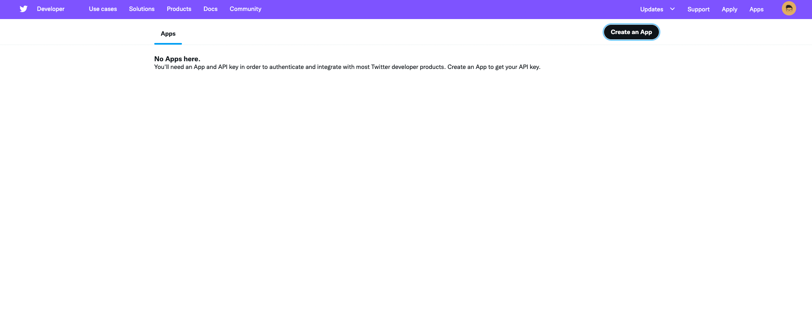

If you haven't yet, you will be asked to apply for an X developer account. See my answers below for reference. If you've done that before, skip the next section and continue at `Create an app <create-an-app_>`_.

Apply for a developer account
-----------------------------

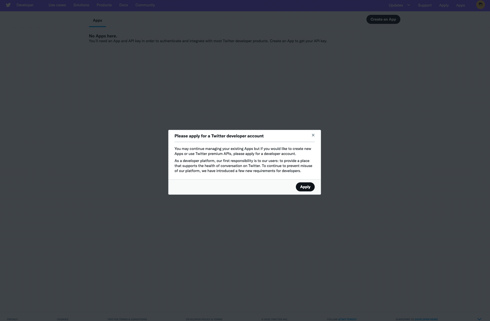
.. _email settings: https://twitter.com/settings/email

You might be asked to add a phone number to your X account before proceeding. If the phone number is used in another account, it won't let you use it again. But you can remove the phone number from the other account. You can change it back once your developer account was approved.

Your X account will also need to be associated with an email address. If it isn't yet, set the email address in your X account `email settings`_.

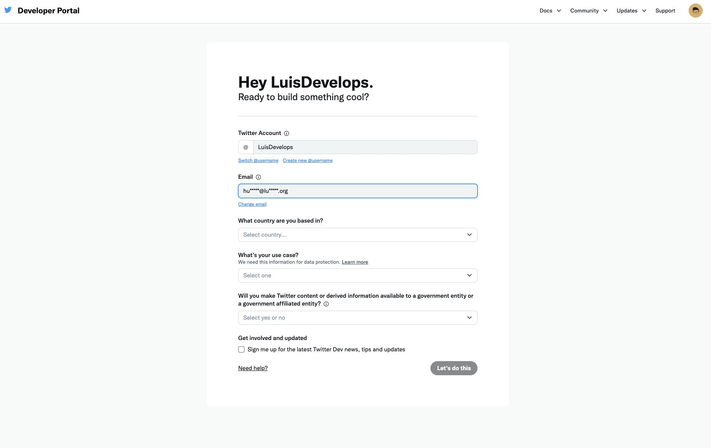

Answer the following questions:

- What country are you based in?

Just put the country where you live in. Be aware that if you live in a US-sanctioned country you might be subject to rejections or limitations to your account.

- What's your use case?

Select Building customized solutions in-house or Making a bot.

- Will you make Twitter content or derived information available to a government entity or a government affiliated enitity?

Answer no.

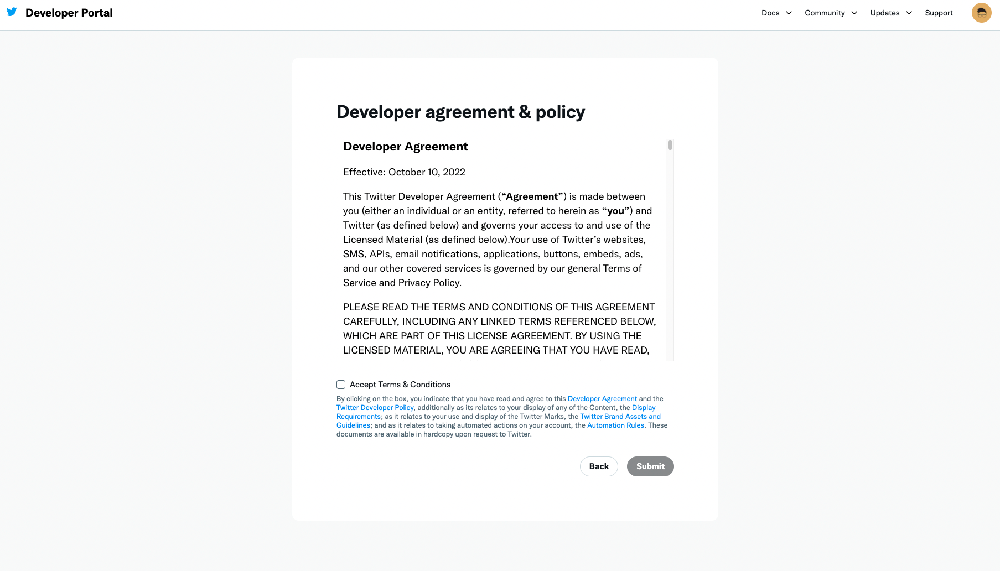

Now accept the terms and conditions.

What to do if you dont qualify
------------------------------

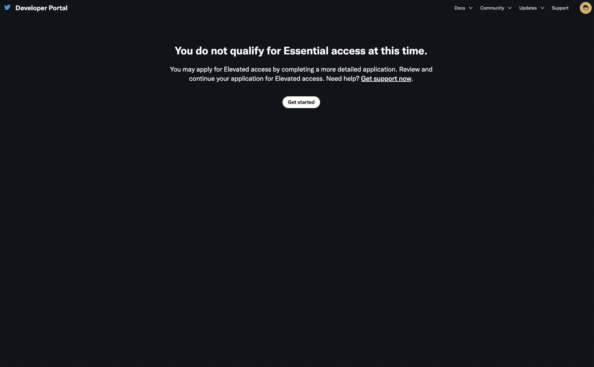
.. _Agoras command line app: https://github.com/LuisAlejandro/agoras

If you dont qualify for a developer account, you'll be asked to fill a more detailed application to request "Elevated access" to APIs. It consists of 4 pages, the first asking some basic information about you.

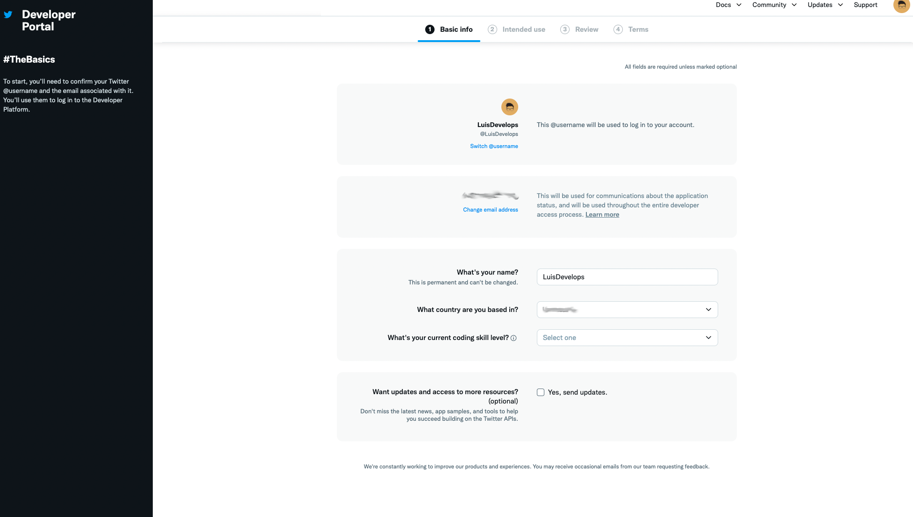

The second page will ask detailed information about your use of the app.

1. In your words

This app will be used to publish tweets using the `Agoras command line app`_. It allows to use a GitHub repository and pull request reviews as a workflow to collaboratively tweet from a shared X account.

2. Are you planning to analyze Twitter data?

No.

3. Will your app use Tweet, Retweet, like, follow, or Direct Message functionality?

Yes. This app will be used to publish tweets for this account.

4. Do you plan to display Tweets or aggregate data about Twitter content outside of Twitter?

No.

5. Will your product, service, or analysis make Twitter content or derived information available to a government entity?

No.

---

You will receive an email to verify your developer account. After that you can create an app at https://developer.twitter.com/en/portal/apps/new.

.. _create-an-app:

Create an app
-------------

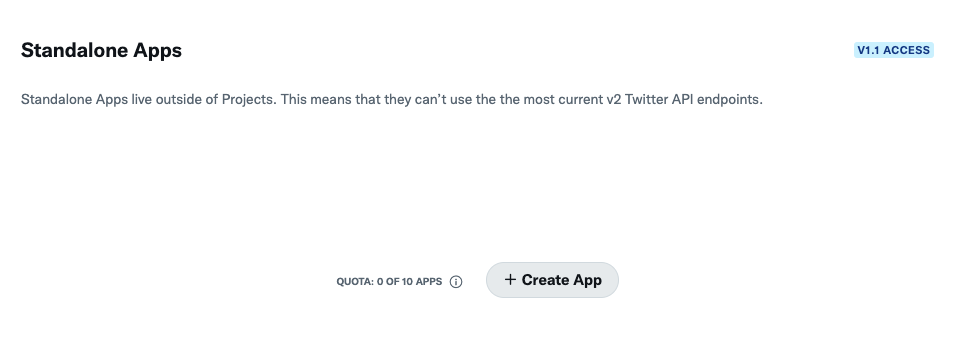

The only thing you need is the name of your app. You can use something like: `<your X account name>-agoras`, e.g. `luisalejandro-agoras`

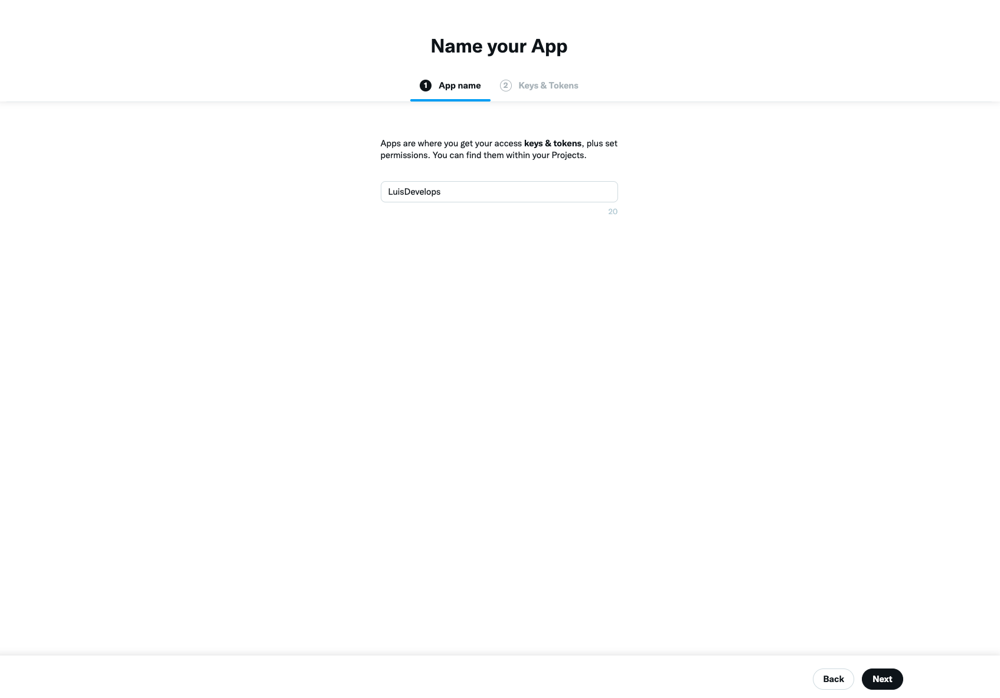

Activate user authentication
----------------------------

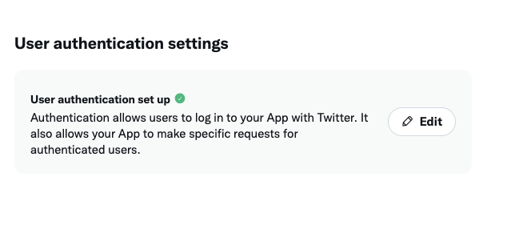

Go to user authentication settings and click edit, then select "Read and write" in App permissions, "Web app, automated app or bot" in Type of app and put ``https://localhost:3456/callback`` in Callback URI/Website URL. Save.

.. note::
   The redirect URI is fixed to ``https://localhost:3456/callback``.

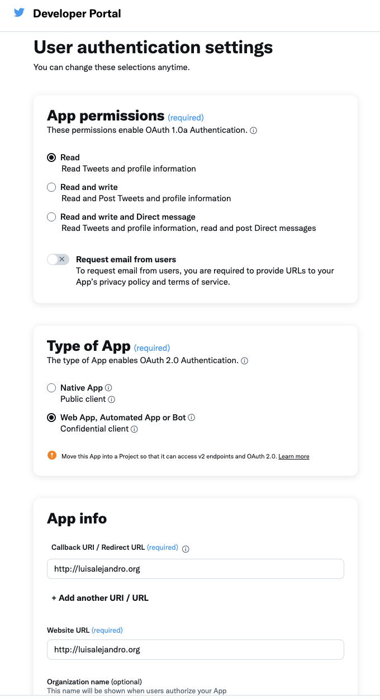

Save credentials
----------------

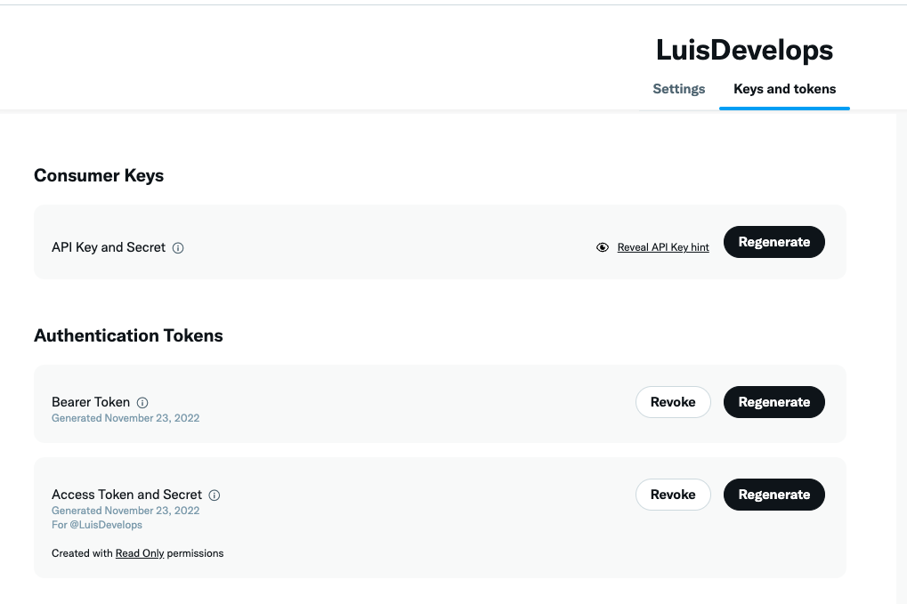

Click regenerate on "API Key and Secret" and take note of:

- API key
- API secret key

**Note**: You do not need to manually extract the Access Token and Access Token Secret. These will be obtained automatically during the authorization process when you run ``agoras x authorize``.

Test your app
-------------

You can test if your X app is properly configured:

1. Make sure you have your API key and API secret key
2. First, authorize and store your credentials:

   ::

         agoras x authorize \
               --consumer-key "your_api_key_here" \
               --consumer-secret "your_api_secret_here"

3. Then test posting to X (credentials are now stored):

   ::

         agoras x post \
               --text "Hello from Agoras!"

4. Check if the post appears on your X profile

**Note**: After authorization, credentials are stored securely in ``~/.agoras/tokens/`` and automatically loaded for future actions.

CI/CD Setup (Unattended Execution)
-----------------------------------

For CI/CD environments where interactive authorization isn't possible, you can skip the ``authorize`` step entirely and provide all required credentials via environment variables.

1. Run ``agoras x authorize`` locally first to store credentials (optional, for local development)
2. Extract stored credentials using the tokens utility command (if you need to retrieve them)::

      # First, list tokens to find the identifier
      agoras utils tokens list --platform x

      # Then view all stored credentials
      agoras utils tokens show --platform x --identifier {identifier}

3. For CI/CD, you have two options:

   **Option A**: Run ``agoras x authorize`` once in your CI/CD pipeline (if interactive mode is possible) to store credentials, then subsequent actions will use stored credentials.

   **Option B**: If you need to skip authorization entirely, you can extract the OAuth token and secret from a previous authorization (using ``agoras utils tokens show``) and set all environment variables::

      export TWITTER_CONSUMER_KEY="your_api_key_here"
      export TWITTER_CONSUMER_SECRET="your_api_secret_here"
      export TWITTER_OAUTH_TOKEN="your_access_token_here"
      export TWITTER_OAUTH_SECRET="your_access_token_secret_here"

4. Run Agoras actions directly. If you've run ``authorize``, credentials will be loaded from storage. Otherwise, they'll be loaded from environment variables.

**Note**: For normal usage, you only need to run ``agoras x authorize`` with your API key and secret. The OAuth token and secret are obtained automatically during the authorization process.

**Security Best Practices for CI/CD**:
- Store credentials in your CI/CD platform's secret management system (GitHub Secrets, GitLab CI/CD Variables, etc.)
- Never commit tokens to version control
- Use different API keys for different environments (dev, staging, production)
- Rotate credentials periodically
- Regenerate credentials immediately if compromised

Agoras parameters
-----------------

**Platform commands** (``agoras x``):

+---------------------+----------------------------+--------------------------------+
| X credential        | Agoras parameter           | Notes                          |
+=====================+============================+================================+
| API key             | --consumer-key             | Required for authorize         |
+---------------------+----------------------------+--------------------------------+
| API secret key      | --consumer-secret          | Required for authorize         |
+---------------------+----------------------------+--------------------------------+
| Access token        | --oauth-token              | Optional (obtained during authorize) |
+---------------------+----------------------------+--------------------------------+
| Access token secret | --oauth-secret             | Optional (obtained during authorize) |
+---------------------+----------------------------+--------------------------------+
| Post ID             | --post-id                  | Required for like/delete/share |
+---------------------+----------------------------+--------------------------------+

**Note**: After running ``agoras x authorize``, all credentials become optional for action commands as they are loaded from secure storage automatically. The OAuth token and secret are obtained automatically during authorization and stored securely. For convenience, you can also use environment variables:

::

    export TWITTER_CONSUMER_KEY="your_api_key_here"
    export TWITTER_CONSUMER_SECRET="your_api_secret_here"

**Utils commands** (``agoras utils``):

+---------------------+----------------------------+
| X credential        | Agoras parameter           |
+=====================+============================+
| API key             | --x-consumer-key           |
+---------------------+----------------------------+
| API secret key      | --x-consumer-secret        |
+---------------------+----------------------------+
| Access token        | --x-oauth-token            |
+---------------------+----------------------------+
| Access token secret | --x-oauth-secret           |
+---------------------+----------------------------+

.. deprecated:: 2.0
   The ``--twitter-*`` parameters in utils commands are deprecated. Use ``--x-*`` parameters instead.
