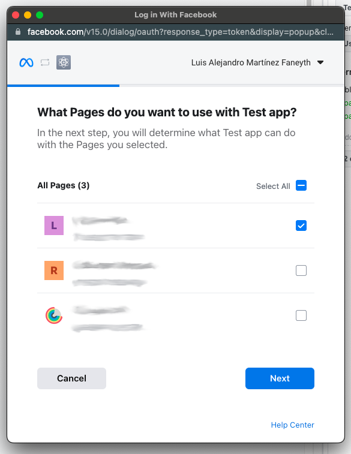
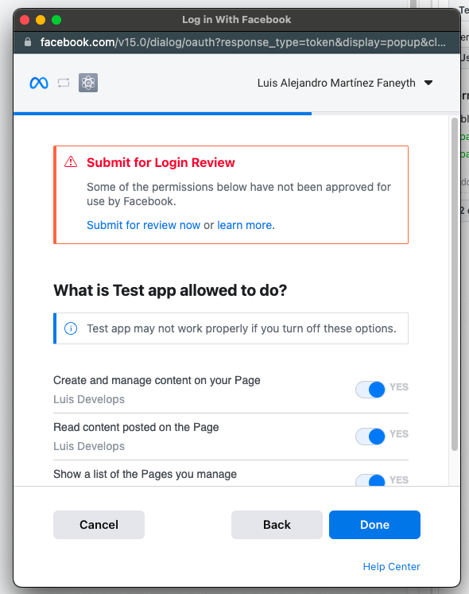

Usage for Facebook
==================

Facebook is a social network that allows you to share text, images and videos with your friends, family and followers. Agoras can publish posts, like posts, share posts and delete posts on Facebook by using a popular `Facebook Graph API client <https://github.com/sns-sdks/python-facebook>`_.

Actions
~~~~~~~

Publish a Facebook post
-----------------------

This command will publish a post on the ``--facebook-object-id`` (read about how to get the id of an account :ref:`here <how-to-get-facebook-account-id>`), which must be authorized by ``--facebook-access-token`` (read about how to get an access token :doc:`here <credentials/facebook>`). ``--status-text`` is the text of your post and can contain URLs that are going to be formatted into clickable links. A facebook post can have a maximum of 63206 characters, so be careful not to exceed it. You can also add up to 4 images in your post using ``--status-image-url-1``, ``--status-image-url-2``, ``--status-image-url-3`` and ``--status-image-url-4``, which must be URLs that point to downloadable images.

.. versionchanged:: 1.1.1
   Added support for ``--status-link`` parameter. If you want to add a link to your post, you can use this parameter. A preview of the link will be embedded in the post. If you want to add a link without a preview, you can add it to the ``--status-text`` parameter. Warning: if you add a link using ``--status-link`` and also add images using any of the ``--status-image-url-X`` parameters, the images will be ignored.

::

      agoras publish \
            --network "facebook" \
            --action "post" \
            --facebook-access-token "${FACEBOOK_ACCESS_TOKEN}" \
            --facebook-object-id "${FACEBOOK_OBJECT_ID}" \
            --status-text "${STATUS_TEXT}" \
            --status-link "${STATUS_LINK}" \
            --status-image-url-1 "${STATUS_IMAGE_URL_1}" \
            --status-image-url-2 "${STATUS_IMAGE_URL_2}" \
            --status-image-url-3 "${STATUS_IMAGE_URL_3}" \
            --status-image-url-4 "${STATUS_IMAGE_URL_4}"

Like a Facebook post
--------------------

This command will "like" a post identified by ``--facebook-post-id`` that is currently published on ``--facebook-object-id`` (read about how to get the id of an account :ref:`here <how-to-get-facebook-account-id>`), which must be authorized by ``--facebook-access-token`` (read about how to get an access token :doc:`here <credentials/facebook>`).
::

      agoras publish \
            --network "facebook" \
            --action "like" \
            --facebook-access-token "${FACEBOOK_ACCESS_TOKEN}" \
            --facebook-object-id "${FACEBOOK_OBJECT_ID}" \
            --facebook-post-id "${FACEBOOK_POST_ID}"

Share a Facebook post
---------------------

This command will grab a post identified by ``--facebook-post-id`` that is currently published on ``--facebook-object-id`` (read about how to get the id of an account :ref:`here <how-to-get-facebook-account-id>`), and share it on a ``--facebook-profile-id`` which must be authorized by ``--facebook-access-token`` (read about how to get an access token :doc:`here <credentials/facebook>`).
::

      agoras publish \
            --network "facebook" \
            --action "share" \
            --facebook-access-token "${FACEBOOK_ACCESS_TOKEN}" \
            --facebook-profile-id "${FACEBOOK_PROFILE_ID}" \
            --facebook-object-id "${FACEBOOK_OBJECT_ID}" \
            --facebook-post-id "${FACEBOOK_POST_ID}"

Delete a Facebook post
----------------------

This command will delete a post identified by ``--facebook-post-id`` that is currently published on ``--facebook-object-id`` (read about how to get the id of an account :ref:`here <how-to-get-facebook-account-id>`), which must be authorized by ``--facebook-access-token`` (read about how to get an access token :doc:`here <credentials/facebook>`).
::

      agoras publish \
            --network "facebook" \
            --action "delete" \
            --facebook-access-token "${FACEBOOK_ACCESS_TOKEN}" \
            --facebook-object-id "${FACEBOOK_OBJECT_ID}" \
            --facebook-post-id "${FACEBOOK_POST_ID}"

Post the last URL from an RSS feed into Facebook
-------------------------------------------------

This command will parse an RSS feed located at ``--feed-url``, and publish the last ``--max-count`` number of entries published in the last ``--post-lookback`` number of seconds. The post content will consist of the title and the link of the feed entry. The post will be published on ``--facebook-object-id`` (read about how to get the id of an account :ref:`here <how-to-get-facebook-account-id>`), which must be authorized by ``--facebook-access-token`` (read about how to get an access token :doc:`here <credentials/facebook>`).

Please read about how the RSS feed should be structured in the :doc:`RSS feed section <rss>`. This ensures that the feed is correctly parsed and that the post content is properly formatted.
::

      agoras publish \
            --network "facebook" \
            --action "last-from-feed" \
            --facebook-access-token "${FACEBOOK_ACCESS_TOKEN}" \
            --facebook-object-id "${FACEBOOK_OBJECT_ID}" \
            --feed-url "${FEED_URL}" \
            --max-count "${MAX_COUNT}" \
            --post-lookback "${POST_LOOKBACK}"

Post a random URL from an RSS feed into Facebook
-------------------------------------------------

This command will parse an RSS feed at ``--feed-url`` and publish one random entry that's not older than ``--max-post-age``. The post content will consist of the title and the link of the feed entry. The post will be published on ``--facebook-object-id`` (read about how to get the id of an account :ref:`here <how-to-get-facebook-account-id>`), which must be authorized by ``--facebook-access-token`` (read about how to get an access token :doc:`here <credentials/facebook>`).

Please read about how the RSS feed should be structured in the :doc:`RSS feed section <rss>`. This ensures that the feed is correctly parsed and that the post content is properly formatted.
::

      agoras publish \
            --network "facebook" \
            --action "random-from-feed" \
            --facebook-access-token "${FACEBOOK_ACCESS_TOKEN}" \
            --facebook-object-id "${FACEBOOK_OBJECT_ID}" \
            --feed-url "${FEED_URL}" \
            --max-post-age "${MAX_POST_AGE}"

Schedule a Facebook post
------------------------

This command will scan a sheet ``--google-sheets-name`` of a google spreadsheet of id ``--google-sheets-id``, thats authorized by ``--google-sheets-client-email`` and ``--google-sheets-private-key``. The post will be published on ``--facebook-object-id`` (read about how to get the id of an account :ref:`here <how-to-get-facebook-account-id>`), which must be authorized by ``--facebook-access-token`` (read about how to get an access token :doc:`here <credentials/facebook>`).

The order of the columns of the spreadsheet is crucial to the correct functioning of the command. Here's how the information should be organized:

+--------------------+--------------------+---------------------------+---------------------------+---------------------------+---------------------------+-------------------------+-------------------+------------------------------+
| ``--status-text``  | ``--status-link``  | ``--status-image-url-1``  | ``--status-image-url-2``  | ``--status-image-url-3``  | ``--status-image-url-4``  | date (%d-%m-%Y format)  | time (%H format)  | status (draft or published)  |
+--------------------+--------------------+---------------------------+---------------------------+---------------------------+---------------------------+-------------------------+-------------------+------------------------------+

As you can see, the first 6 columns correspond to the parameters of the "post" command, the date and time columns correspond to the specific time that you want to publish this post, and the status column tells the script if this post is ready to be published (draft status) or if it was already published and should be skipped (published status). Let's see an example of a working schedule:

+-------------------------------+-------------------------------------------+---------------------------------------------------------+---------------------------------------------------------+---------------------------------------------------------+---------------------------------------------------------+-------------+-----+--------+
| This is a test facebook post  | https://agoras.readthedocs.io/en/latest/  | https://pbs.twimg.com/media/Ej3d42zXsAEfDCr?format=jpg  | https://pbs.twimg.com/media/Ej3d42zXsAEfDCr?format=jpg  | https://pbs.twimg.com/media/Ej3d42zXsAEfDCr?format=jpg  | https://pbs.twimg.com/media/Ej3d42zXsAEfDCr?format=jpg  | 21-11-2022  | 17  | draft  |
+-------------------------------+-------------------------------------------+---------------------------------------------------------+---------------------------------------------------------+---------------------------------------------------------+---------------------------------------------------------+-------------+-----+--------+

This schedule entry would be published at 17:00h of 21-11-2022 with text "This is a test facebook post" and 4 images pointed by those URLs.

For this command to work, it should be executed hourly by a cron script.
::

      agoras publish \
            --network "facebook" \
            --action "schedule" \
            --facebook-access-token "${FACEBOOK_ACCESS_TOKEN}" \
            --facebook-object-id "${FACEBOOK_OBJECT_ID}" \
            --google-sheets-id "${GOOGLE_SHEETS_ID}" \
            --google-sheets-name "${GOOGLE_SHEETS_NAME}" \
            --google-sheets-client-email "${GOOGLE_SHEETS_CLIENT_EMAIL}" \
            --google-sheets-private-key "${GOOGLE_SHEETS_PRIVATE_KEY}"

.. _how-to-get-facebook-account-id:

How to get ``--facebook-object-id`` parameter
~~~~~~~~~~~~~~~~~~~~~~~~~~~~~~~~~~~~~~~~~~~~~

With Agoras you can use the facebook network to post to pages, profiles and groups, but for simplicity sake we're going to only explain how to get the object ID of a page.

To find your Page ID go to the following URL, replacing ``{page_name}`` with the pretty name of your page url. For example, in https://www.facebook.com/LuisDevelops, the ``{page_name}`` is ``LuisDevelops``. Put the URL in your browser and hit enter.
::

      https://developers.facebook.com/tools/explorer/?method=GET&path={page_name}

Then click on submit and you'll see a response like this::

      {
            "name": "Luis Develops",
            "id": "ZZZZZZZ"
      }

`ZZZZZZZ` is your page ID.

.. _how-to-get-facebook-post-id:

How to get ``--facebook-post-id`` parameter
~~~~~~~~~~~~~~~~~~~~~~~~~~~~~~~~~~~~~~~~~~~

Extracting from Facebook website
--------------------------------

The post ID parameter is necessary to like, share and delete posts. You can extract it from the post URL::

      https://www.facebook.com/XXXXX/posts/NNNNNNNNNNN

If ``NNNNNNNNNNN`` consists only of numbers, then that's the post ID. If it contains other characters, then it's not the post ID and you'll need to do an extra step.

Copy the entire post URL and paste it in the following URL, replacing ``{post_url}`` with the URL you just copied. Put the URL in your browser and hit enter.

::

      https://www.facebook.com/plugins/post.php?href={post_url}

You'll see a page like the one in the image:

Click on the timestamp of the post (highlighted in red) and you'll be redirected to a page like this::

      https://www.facebook.com/XXXXX/posts/NNNNNNNNNNN

Now you can copy the post ID (``NNNNNNNNNNN``) from the URL.

Using Agoras
------------

When you create a facebook post with Agoras, it will print the post ID (in json format) in the console. You can copy it from there and use it in other commands. For example::

      $ agoras publish \
            --network facebook \
            --action post \
            --facebook-access-token XXXXX \
            --facebook-object-id XXXXX \
            --status-text "This is a test post"
      $ {"id":"NNNNNNNNNNN"}

``NNNNNNNNNNN`` is the post ID.
