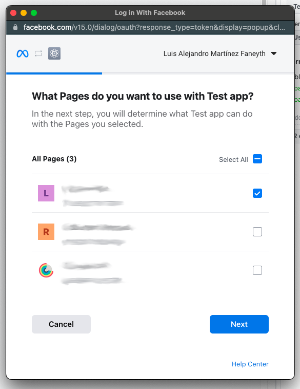
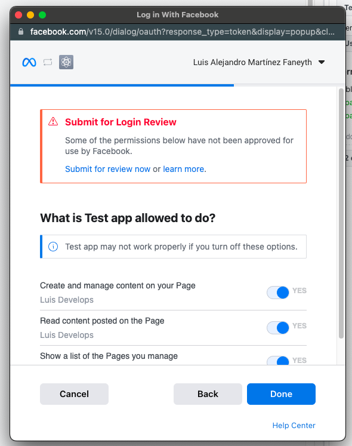

Usage for Facebook
==================

.. note::
   **New in version 2.0**: Facebook commands now use the intuitive ``agoras facebook`` format.
   See the :doc:`migration guide <migration>` for upgrading from ``agoras publish``.

Facebook is a social network that allows you to share text, images and videos with your friends, family and followers. Agoras can publish posts, like posts, share posts and delete posts on Facebook by using a popular `Facebook Graph API client <https://github.com/sns-sdks/python-facebook>`_.

Required Credentials
--------------------

Before using Agoras with Facebook, you'll need to manually extract the following credentials from your Facebook App in the Meta Developer Console. These credentials are required for OAuth 2.0 authentication.

- **Client ID** (``FACEBOOK_CLIENT_ID``): Your Facebook App ID, used as the OAuth client identifier
- **Client Secret** (``FACEBOOK_CLIENT_SECRET``): Your Facebook App Secret, used for OAuth authentication
- **App ID** (``FACEBOOK_APP_ID``): Your Facebook App ID (same as Client ID)
- **Object ID** (``FACEBOOK_OBJECT_ID``): The ID of the Facebook page, profile, or group you want to post to

See :doc:`credentials/facebook` for detailed instructions on how to create a Facebook App and obtain these credentials.

Available Actions
~~~~~~~~~~~~~~~~~

* ``authorize`` - Set up OAuth 2.0 authentication (required first step)
* ``post`` - Create text and image posts (up to 4 images)
* ``video`` - Upload videos
* ``like`` - Like posts
* ``share`` - Share posts to your profile
* ``delete`` - Delete your own posts

Authorization
-------------

.. versionadded:: 2.0
   OAuth 2.0 "authorize first" workflow

Before performing any actions, you must authorize Agoras to access your Facebook account::

    agoras facebook authorize \
      --client-id "${FACEBOOK_CLIENT_ID}" \
      --client-secret "${FACEBOOK_CLIENT_SECRET}" \
      --app-id "${FACEBOOK_APP_ID}" \
      --object-id "${FACEBOOK_OBJECT_ID}"

This will:

1. Open your browser to the Facebook OAuth authorization page
2. Prompt you to grant permissions to Agoras
3. Automatically capture the authorization code
4. Store encrypted credentials in ``~/.agoras/tokens/``

After authorization, you can perform actions without providing tokens. Credentials are automatically refreshed when needed.

For CI/CD environments, see :doc:`credentials/facebook` for unattended execution setup.

Post to Facebook
----------------

**New format**::

    agoras facebook post \
      --object-id "${FACEBOOK_OBJECT_ID}" \
      --text "${STATUS_TEXT}" \
      --link "${STATUS_LINK}" \
      --image-1 "${IMAGE_URL_1}" \
      --image-2 "${IMAGE_URL_2}"

.. note::
   You must run ``agoras facebook authorize`` first before using this command.

.. versionchanged:: 2.0
   Parameters simplified: ``--text`` instead of ``--status-text``, ``--image-1`` instead of ``--status-image-url-1``

.. note::
   If you add a link using ``--link`` and also add images, the images may be ignored depending on Facebook's API behavior.

Upload a Video
--------------

**New format**::

    agoras facebook video \
      --object-id "${FACEBOOK_OBJECT_ID}" \
      --video-url "${VIDEO_URL}" \
      --video-title "${VIDEO_TITLE}" \
      --video-description "${VIDEO_DESCRIPTION}"

.. note::
   You must run ``agoras facebook authorize`` first before using this command.

Like a Post
-----------

This command will "like" a post identified by ``--post-id`` (read about how to get the id of a post :ref:`here <how-to-get-facebook-post-id>`).

.. note::
   You must run ``agoras facebook authorize`` first before using this command.

**New format**::

    agoras facebook like \
      --post-id "${FACEBOOK_POST_ID}"

Share a Post
------------

This command will grab a post identified by ``--post-id`` that is currently published on ``--object-id`` (read about how to get the id of an account :ref:`here <how-to-get-facebook-account-id>`), and share it on a ``--profile-id``.

.. note::
   You must run ``agoras facebook authorize`` first before using this command.

**New format**::

    agoras facebook share \
      --object-id "${FACEBOOK_OBJECT_ID}" \
      --post-id "${FACEBOOK_POST_ID}" \
      --profile-id "${FACEBOOK_PROFILE_ID}"

Delete a Facebook post
----------------------

This command will delete a post identified by ``--post-id`` that is currently published on ``--object-id`` (read about how to get the id of an account :ref:`here <how-to-get-facebook-account-id>`).

.. note::
   You must run ``agoras facebook authorize`` first before using this command.

**New format**::

    agoras facebook delete \
      --object-id "${FACEBOOK_OBJECT_ID}" \
      --post-id "${FACEBOOK_POST_ID}"

Post the last URL from an RSS feed into Facebook
-------------------------------------------------

This command will parse an RSS feed located at ``--feed-url``, and publish the last ``--max-count`` number of entries published in the last ``--post-lookback`` number of seconds. The post content will consist of the title and the link of the feed entry. The post will be published on ``--facebook-object-id`` (read about how to get the id of an account :ref:`here <how-to-get-facebook-account-id>`).

.. note::
   You must run ``agoras facebook authorize`` first before using this command.

Please read about how the RSS feed should be structured in the :doc:`RSS feed section <rss>`. This ensures that the feed is correctly parsed and that the post content is properly formatted.
::

      agoras utils feed-publish \
            --network "facebook" \
            --mode "last" \
            --facebook-object-id "${FACEBOOK_OBJECT_ID}" \
            --feed-url "${FEED_URL}" \
            --max-count "${MAX_COUNT}" \
            --post-lookback "${POST_LOOKBACK}"

Post a random URL from an RSS feed into Facebook
-------------------------------------------------

This command will parse an RSS feed at ``--feed-url`` and publish one random entry that's not older than ``--max-post-age``. The post content will consist of the title and the link of the feed entry. The post will be published on ``--facebook-object-id`` (read about how to get the id of an account :ref:`here <how-to-get-facebook-account-id>`).

.. note::
   You must run ``agoras facebook authorize`` first before using this command.

Please read about how the RSS feed should be structured in the :doc:`RSS feed section <rss>`. This ensures that the feed is correctly parsed and that the post content is properly formatted.
::

      agoras utils feed-publish \
            --network "facebook" \
            --mode "random" \
            --facebook-object-id "${FACEBOOK_OBJECT_ID}" \
            --feed-url "${FEED_URL}" \
            --max-post-age "${MAX_POST_AGE}"

Google Sheets Scheduling
------------------------

Agoras can schedule Facebook posts using Google Sheets. This allows you to plan and automate post publishing.

Run Scheduled Messages
~~~~~~~~~~~~~~~~~~~~~~

Process scheduled messages from a Google Sheet:

::

    agoras utils schedule-run \
      --network facebook \
      --sheets-id "${GOOGLE_SHEETS_ID}" \
      --sheets-name "Facebook" \
      --sheets-client-email "${GOOGLE_SHEETS_CLIENT_EMAIL}" \
      --sheets-private-key "${GOOGLE_SHEETS_PRIVATE_KEY}" \
      --facebook-object-id "${FACEBOOK_OBJECT_ID}"

.. note::
   You must run ``agoras facebook authorize`` first before using this command.

Sheet Format
~~~~~~~~~~~~

Your Google Sheet should have the following columns:

- ``status_text``: Post text content
- ``status_link``: URL to include in post
- ``status_image_url_1`` through ``status_image_url_4``: Image URLs (optional)
- ``date``: Scheduled date (format: DD-MM-YYYY)
- ``hour``: Scheduled hour (format: HH, 24-hour format)
- ``state``: Post state (``pending``, ``published``, ``error``)

**Example sheet row**:

::

    status_text,status_link,status_image_url_1,status_image_url_2,status_image_url_3,status_image_url_4,date,hour,state
    "This is a test facebook post","https://agoras.readthedocs.io/en/latest/","https://pbs.twimg.com/media/Ej3d42zXsAEfDCr?format=jpg","https://pbs.twimg.com/media/Ej3d42zXsAEfDCr?format=jpg","","","21-11-2022","17","pending"

Scheduling Logic
~~~~~~~~~~~~~~~~

- Posts with ``state="pending"`` and scheduled time in the past are processed
- Posts are created at the scheduled date and hour
- Sheet state is updated to ``published`` after successful posting
- If posting fails, state is updated to ``error``
- Use ``--network facebook`` to process only Facebook posts, or omit to process all networks

.. _how-to-get-facebook-account-id:

How to get ``--facebook-object-id`` parameter
~~~~~~~~~~~~~~~~~~~~~~~~~~~~~~~~~~~~~~~~~~~~~

With Agoras you can use the facebook network to post to pages, profiles and groups, but for simplicity sake we're going to only explain how to get the object ID of a page.

To find your Page ID go to the following URL, replacing ``{page_name}`` with the pretty name of your page url. For example, in https://www.facebook.com/LuisDevelops, the ``{page_name}`` is ``LuisDevelops``. Put the URL in your browser and hit enter.
::

      https://developers.facebook.com/tools/explorer/?method=GET&path={page_name}

Then click on submit and you'll see a response like this::

      {
            "name": "Luis Develops",
            "id": "ZZZZZZZ"
      }

`ZZZZZZZ` is your page ID.

.. _how-to-get-facebook-post-id:

How to get ``--facebook-post-id`` parameter
~~~~~~~~~~~~~~~~~~~~~~~~~~~~~~~~~~~~~~~~~~~

Extracting from Facebook website
--------------------------------

The post ID parameter is necessary to like, share and delete posts. You can extract it from the post URL::

      https://www.facebook.com/XXXXX/posts/NNNNNNNNNNN

If ``NNNNNNNNNNN`` consists only of numbers, then that's the post ID. If it contains other characters, then it's not the post ID and you'll need to do an extra step.

Copy the entire post URL and paste it in the following URL, replacing ``{post_url}`` with the URL you just copied. Put the URL in your browser and hit enter.

::

      https://www.facebook.com/plugins/post.php?href={post_url}

You'll see a page like the one in the image:

Click on the timestamp of the post (highlighted in red) and you'll be redirected to a page like this::

      https://www.facebook.com/XXXXX/posts/NNNNNNNNNNN

Now you can copy the post ID (``NNNNNNNNNNN``) from the URL.

Using Agoras
------------

When you create a facebook post with Agoras, it will print the post ID (in json format) in the console. You can copy it from there and use it in other commands. For example::

      $ agoras facebook post \
            --object-id XXXXX \
            --text "This is a test post"
      $ {"id":"NNNNNNNNNNN"}

``NNNNNNNNNNN`` is the post ID.
