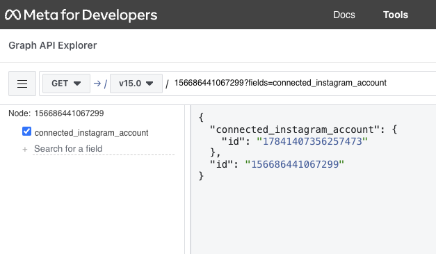

Usage for Instagram
===================

Instagram is a social network that allows you to share photos and videos with your friends and followers. Agoras uses a popular `Facebook Graph API client <https://github.com/sns-sdks/python-facebook>`_ to publish posts. Only publishing is allowed by the API, so you can't like, share or delete posts.

Actions
~~~~~~~

Publish a Instagram post
------------------------

This command will publish a post on the ``--instagram-object-id`` (read about how to get the id of an account :ref:`here <how-to-get-instagram-account-id>`), which must be authorized by ``--instagram-access-token`` (read about how to get an access token :doc:`here <credentials/instagram>`). ``--status-text`` is the text of your post (URLs won't be transformed into clickable links). A instagram post can have a maximum of 2200 characters, so be careful not to exceed it. You can also add up to 4 images in your post using ``--status-image-url-1``, ``--status-image-url-2``, ``--status-image-url-3`` and ``--status-image-url-4``, which must be URLs that point to downloadable images.
::
  
      agoras publish \
            --network "instagram" \
            --action "post" \
            --instagram-access-token "${INSTAGRAM_ACCESS_TOKEN}" \
            --instagram-object-id "${INSTAGRAM_OBJECT_ID}" \
            --status-text "${STATUS_TEXT}" \
            --status-image-url-1 "${STATUS_IMAGE_URL_1}" \
            --status-image-url-2 "${STATUS_IMAGE_URL_2}" \
            --status-image-url-3 "${STATUS_IMAGE_URL_3}" \
            --status-image-url-4 "${STATUS_IMAGE_URL_4}"

Like a Instagram post
---------------------

Action not supported by Instagram Graph API.

Share a Instagram post
----------------------

Action not supported by Instagram Graph API.

Delete a Instagram post
-----------------------

Action not supported by Instagram Graph API.

Post the last URL from an RSS feed into Instagram
--------------------------------------------------

This command will parse an RSS feed located at ``--feed-url``, and publish the last ``--max-count`` number of entries published in the last ``--post-lookback`` number of seconds. The post content will consist of the title and the link of the feed entry. The post will be published on ``--instagram-object-id`` (read about how to get the id of an account :ref:`here <how-to-get-instagram-account-id>`), which must be authorized by ``--instagram-access-token`` (read about how to get an access token :doc:`here <credentials/instagram>`).

Please read about how the RSS feed should be structured in the :doc:`RSS feed section <rss>`. This ensures that the feed is correctly parsed and that the post content is properly formatted.
::
  
      agoras publish \
            --network "instagram" \
            --action "last-from-feed" \
            --instagram-access-token "${INSTAGRAM_ACCESS_TOKEN}" \
            --instagram-object-id "${INSTAGRAM_OBJECT_ID}" \
            --feed-url "${FEED_URL}" \
            --max-count "${MAX_COUNT}" \
            --post-lookback "${POST_LOOKBACK}"

Post a random URL from an RSS feed into Instagram
--------------------------------------------------

This command will parse an RSS feed at ``--feed-url`` and publish one random entry that's not older than ``--max-post-age``. The post content will consist of the title and the link of the feed entry. The post will be published on ``--instagram-object-id`` (read about how to get the id of an account :ref:`here <how-to-get-instagram-account-id>`), which must be authorized by ``--instagram-access-token`` (read about how to get an access token :doc:`here <credentials/instagram>`).

Please read about how the RSS feed should be structured in the :doc:`RSS feed section <rss>`. This ensures that the feed is correctly parsed and that the post content is properly formatted.
::
  
      agoras publish \
            --network "instagram" \
            --action "random-from-feed" \
            --instagram-access-token "${INSTAGRAM_ACCESS_TOKEN}" \
            --instagram-object-id "${INSTAGRAM_OBJECT_ID}" \
            --feed-url "${FEED_URL}" \
            --max-post-age "${MAX_POST_AGE}"

Schedule a Instagram post
-------------------------

This command will scan a sheet ``--google-sheets-name`` of a google spreadsheet of id ``--google-sheets-id``, thats authorized by ``--google-sheets-client-email`` and ``--google-sheets-private-key``. The post will be published on ``--instagram-object-id`` (read about how to get the id of an account :ref:`here <how-to-get-instagram-account-id>`), which must be authorized by ``--instagram-access-token`` (read about how to get an access token :doc:`here <credentials/instagram>`).

The order of the columns of the spreadsheet is crucial to the correct functioning of the command. Here's how the information should be organized:

+--------------------+--------------------+---------------------------+---------------------------+---------------------------+---------------------------+-------------------------+-------------------+------------------------------+
| ``--status-text``  | ``--status-link``  | ``--status-image-url-1``  | ``--status-image-url-2``  | ``--status-image-url-3``  | ``--status-image-url-4``  | date (%d-%m-%Y format)  | time (%H format)  | status (draft or published)  |
+--------------------+--------------------+---------------------------+---------------------------+---------------------------+---------------------------+-------------------------+-------------------+------------------------------+

As you can see, the first 6 columns correspond to the parameters of the "post" command, the date and time columns correspond to the specific time that you want to publish this post, and the status column tells the script if this post is ready to be published (draft status) or if it was already published and should be skipped (published status). Let's see an example of a working schedule:

+-------------------------------+-------------------------------------------+---------------------------------------------------------+---------------------------------------------------------+---------------------------------------------------------+---------------------------------------------------------+-------------+-----+--------+
| This is a test facebook post  | https://agoras.readthedocs.io/en/latest/  | https://pbs.twimg.com/media/Ej3d42zXsAEfDCr?format=jpg  | https://pbs.twimg.com/media/Ej3d42zXsAEfDCr?format=jpg  | https://pbs.twimg.com/media/Ej3d42zXsAEfDCr?format=jpg  | https://pbs.twimg.com/media/Ej3d42zXsAEfDCr?format=jpg  | 21-11-2022  | 17  | draft  |
+-------------------------------+-------------------------------------------+---------------------------------------------------------+---------------------------------------------------------+---------------------------------------------------------+---------------------------------------------------------+-------------+-----+--------+

This schedule entry would be published at 17:00h of 21-11-2022 with text "This is a test instagram post" and 4 images pointed by those URLs.

For this command to work, it should be executed hourly by a cron script.
::
  
      agoras publish \
            --network "instagram" \
            --action "schedule" \
            --instagram-access-token "${INSTAGRAM_ACCESS_TOKEN}" \
            --instagram-object-id "${INSTAGRAM_OBJECT_ID}" \
            --google-sheets-id "${GOOGLE_SHEETS_ID}" \
            --google-sheets-name "${GOOGLE_SHEETS_NAME}" \
            --google-sheets-client-email "${GOOGLE_SHEETS_CLIENT_EMAIL}" \
            --google-sheets-private-key "${GOOGLE_SHEETS_PRIVATE_KEY}"

.. _how-to-get-instagram-account-id:

How to get ``--instagram-object-id`` parameter
~~~~~~~~~~~~~~~~~~~~~~~~~~~~~~~~~~~~~~~~~~~~~

With Agoras you can use the Instagram network to create posts. You're going to need the ID of the instagram account, for that we're going to need the id of the facebook page that's associated with the instagram account. Replace ``{page_id}`` in the following URL, then put it on your browser and hit enter::

      https://developers.facebook.com/tools/explorer/?method=GET&path={page_id}%3Ffields%3Dconnected_instagram_account

Then click on submit and you'll see a response like this::

      {
            "connected_instagram_account": {
                  "id": "ZZZZZZZ"
            },
            "id": "YYYYYYY"
      }

"ZZZZZZZ" is your Instagram aacount ID.

