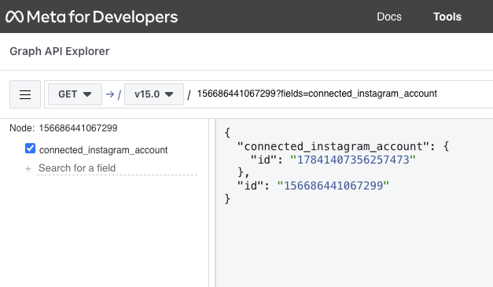

Usage for Instagram
===================

Instagram is a social network that allows you to share photos and videos with your friends and followers. Agoras uses a popular `Facebook Graph API client <https://github.com/sns-sdks/python-facebook>`_ to publish posts. Only publishing is allowed by the API, so you can't like, share or delete posts.

Required Credentials
--------------------

Before using Agoras with Instagram, you'll need to manually extract the following credentials from your Facebook App in the Meta Developer Console. Instagram uses Facebook OAuth, so you'll need a Facebook App connected to your Instagram business account.

- **Client ID** (``INSTAGRAM_CLIENT_ID``): Your Facebook App ID, used as the OAuth client identifier
- **Client Secret** (``INSTAGRAM_CLIENT_SECRET``): Your Facebook App Secret, used for OAuth authentication
- **Object ID** (``INSTAGRAM_OBJECT_ID``): The Facebook User ID that has access to the Instagram business account

See :doc:`credentials/instagram` for detailed instructions on how to create a Facebook App, connect it to your Instagram account, and obtain these credentials.

Available Actions
~~~~~~~~~~~~~~~~~

* ``authorize`` - Set up OAuth 2.0 authentication (required first step)
* ``post`` - Create Instagram posts with images
* ``video`` - Upload videos to Instagram

Authorization
-------------

.. versionadded:: 2.0
   OAuth 2.0 "authorize first" workflow

Before performing any actions, you must authorize Agoras to access your Instagram account::

    agoras instagram authorize \
      --client-id "${INSTAGRAM_CLIENT_ID}" \
      --client-secret "${INSTAGRAM_CLIENT_SECRET}" \
      --object-id "${INSTAGRAM_OBJECT_ID}"

This will:

1. Open your browser to the Facebook OAuth authorization page (Instagram uses Facebook OAuth)
2. Prompt you to grant permissions to Agoras
3. Automatically capture the authorization code
4. Store encrypted credentials in ``~/.agoras/tokens/``

After authorization, you can perform actions without providing tokens. Credentials are automatically refreshed when needed.

For CI/CD environments, see :doc:`credentials/instagram` for unattended execution setup.

Publish a Instagram post
------------------------

This command will publish a post on the ``--object-id`` (read about how to get the id of an account :ref:`here <how-to-get-instagram-account-id>`). ``--text`` is the text of your post (URLs won't be transformed into clickable links). A instagram post can have a maximum of 2200 characters, so be careful not to exceed it. You can also add up to 4 images in your post using ``--image-1``, ``--image-2``, ``--image-3`` and ``--image-4``, which must be URLs that point to downloadable images.

.. note::
   You must run ``agoras instagram authorize`` first before using this command.

**New format**::

    agoras instagram post \
      --object-id "${INSTAGRAM_OBJECT_ID}" \
      --text "${STATUS_TEXT}" \
      --image-1 "${IMAGE_URL_1}" \
      --image-2 "${IMAGE_URL_2}" \
      --image-3 "${IMAGE_URL_3}" \
      --image-4 "${IMAGE_URL_4}"

Like a Instagram post
---------------------

Action not supported by Instagram Graph API.

Share a Instagram post
----------------------

Action not supported by Instagram Graph API.

Delete a Instagram post
-----------------------

Action not supported by Instagram Graph API.

Post the last URL from an RSS feed into Instagram
--------------------------------------------------

This command will parse an RSS feed located at ``--feed-url``, and publish the last ``--max-count`` number of entries published in the last ``--post-lookback`` number of seconds. The post content will consist of the title and the link of the feed entry. The post will be published on ``--instagram-object-id`` (read about how to get the id of an account :ref:`here <how-to-get-instagram-account-id>`).

.. note::
   You must run ``agoras instagram authorize`` first before using this command.

Please read about how the RSS feed should be structured in the :doc:`RSS feed section <rss>`. This ensures that the feed is correctly parsed and that the post content is properly formatted.
::

      agoras utils feed-publish \
            --network "instagram" \
            --mode "last" \
            --instagram-object-id "${INSTAGRAM_OBJECT_ID}" \
            --feed-url "${FEED_URL}" \
            --max-count "${MAX_COUNT}" \
            --post-lookback "${POST_LOOKBACK}"

Post a random URL from an RSS feed into Instagram
--------------------------------------------------

This command will parse an RSS feed at ``--feed-url`` and publish one random entry that's not older than ``--max-post-age``. The post content will consist of the title and the link of the feed entry. The post will be published on ``--instagram-object-id`` (read about how to get the id of an account :ref:`here <how-to-get-instagram-account-id>`).

.. note::
   You must run ``agoras instagram authorize`` first before using this command.

Please read about how the RSS feed should be structured in the :doc:`RSS feed section <rss>`. This ensures that the feed is correctly parsed and that the post content is properly formatted.
::

      agoras utils feed-publish \
            --network "instagram" \
            --mode "random" \
            --instagram-object-id "${INSTAGRAM_OBJECT_ID}" \
            --feed-url "${FEED_URL}" \
            --max-post-age "${MAX_POST_AGE}"

Google Sheets Scheduling
------------------------

Agoras can schedule Instagram posts using Google Sheets. This allows you to plan and automate post publishing.

Run Scheduled Messages
~~~~~~~~~~~~~~~~~~~~~~

Process scheduled messages from a Google Sheet:

::

    agoras utils schedule-run \
      --network instagram \
      --sheets-id "${GOOGLE_SHEETS_ID}" \
      --sheets-name "Instagram" \
      --sheets-client-email "${GOOGLE_SHEETS_CLIENT_EMAIL}" \
      --sheets-private-key "${GOOGLE_SHEETS_PRIVATE_KEY}" \
      --instagram-object-id "${INSTAGRAM_OBJECT_ID}"

.. note::
   You must run ``agoras instagram authorize`` first before using this command.

Sheet Format
~~~~~~~~~~~~

Your Google Sheet should have the following columns:

- ``status_text``: Post text content
- ``status_link``: URL to include in post
- ``status_image_url_1`` through ``status_image_url_4``: Image URLs (optional)
- ``date``: Scheduled date (format: DD-MM-YYYY)
- ``hour``: Scheduled hour (format: HH, 24-hour format)
- ``state``: Post state (``pending``, ``published``, ``error``)

**Example sheet row**:

::

    status_text,status_link,status_image_url_1,status_image_url_2,status_image_url_3,status_image_url_4,date,hour,state
    "This is a test instagram post","https://agoras.readthedocs.io/en/latest/","https://pbs.twimg.com/media/Ej3d42zXsAEfDCr?format=jpg","https://pbs.twimg.com/media/Ej3d42zXsAEfDCr?format=jpg","","","21-11-2022","17","pending"

Scheduling Logic
~~~~~~~~~~~~~~~~

- Posts with ``state="pending"`` and scheduled time in the past are processed
- Posts are created at the scheduled date and hour
- Sheet state is updated to ``published`` after successful posting
- If posting fails, state is updated to ``error``
- Use ``--network instagram`` to process only Instagram posts, or omit to process all networks

.. _how-to-get-instagram-account-id:

How to get ``--instagram-object-id`` parameter
~~~~~~~~~~~~~~~~~~~~~~~~~~~~~~~~~~~~~~~~~~~~~

With Agoras you can use the Instagram network to create posts. You're going to need the ID of the instagram account, for that we're going to need the id of the facebook page that's associated with the instagram account. Replace ``{page_id}`` in the following URL, then put it on your browser and hit enter::

      https://developers.facebook.com/tools/explorer/?method=GET&path={page_id}%3Ffields%3Dconnected_instagram_account

Then click on submit and you'll see a response like this::

      {
            "connected_instagram_account": {
                  "id": "ZZZZZZZ"
            },
            "id": "YYYYYYY"
      }

"ZZZZZZZ" is your Instagram aacount ID.

