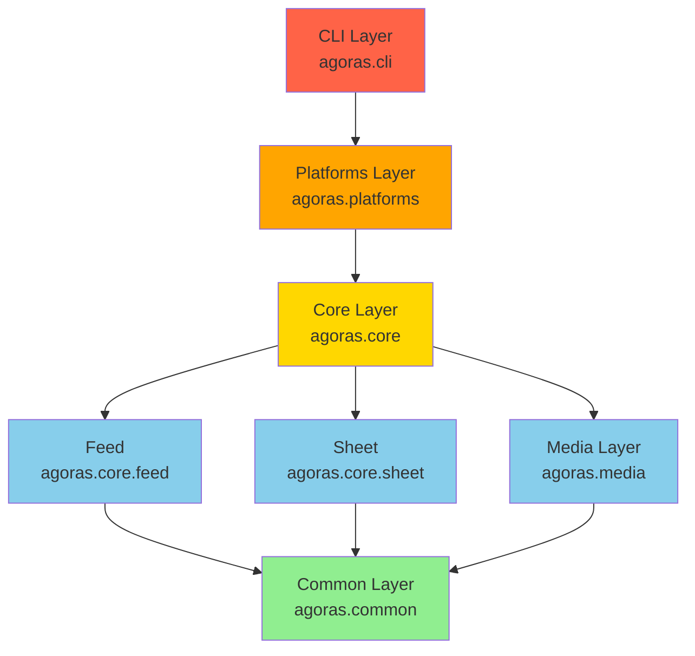
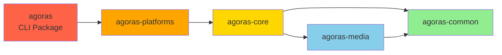

# Module Dependency Analysis

This document analyzes the current module dependencies in Agoras to ensure clean layering for the package split.

## Target Architecture

The package split aims to achieve this layered architecture:

```
CLI → Platforms → Core → Media/Feed/Sheet → Common
```

## Current Dependency Analysis

### Layer 0: Common (No Dependencies)

**Modules**:
- `agoras/core/utils.py`
- `agoras/core/logger.py`
- `agoras/__init__.py` (metadata only)

**Dependencies**: None

**Status**: ✅ Clean - Ready to extract

---

### Layer 1: Media (Depends on Common)

**Modules**:
- `agoras/core/media/base.py`
- `agoras/core/media/image.py`
- `agoras/core/media/video.py`
- `agoras/core/media/factory.py`

**Dependencies**:
- `agoras/__version__` (from `__init__.py`) → will move to `agoras.common`

**Current Imports**:
```python
# From agoras/core/media/base.py
from agoras import __version__
```

**Status**: ✅ Clean - Ready to extract after Common

---

### Layer 2a: Feed (Depends on Common)

**Modules**:
- `agoras/core/feed/feed.py`
- `agoras/core/feed/item.py`
- `agoras/core/feed/manager.py`

**Dependencies**:
- `agoras/__version__` (from `__init__.py`) → will move to `agoras.common`
- `agoras/core/utils.add_url_timestamp` → will move to `agoras.common.utils`

**Current Imports**:
```python
# From agoras/core/feed/feed.py
from agoras import __version__

# From agoras/core/feed/item.py
from agoras.core.utils import add_url_timestamp
```

**Status**: ✅ Clean - Ready to extract after Common

---

### Layer 2b: Sheet (Depends on Common)

**Modules**:
- `agoras/core/sheet/sheet.py`
- `agoras/core/sheet/manager.py`
- `agoras/core/sheet/row.py`
- `agoras/core/sheet/schedule.py`

**Dependencies**:
- No internal dependencies found

**Status**: ✅ Clean - Ready to extract

---

### Layer 3: Core (Depends on Common, Media, Feed, Sheet)

**Modules**:
- `agoras/core/base.py` (SocialNetwork interface)
- `agoras/core/api/base.py` (BaseAPI)
- `agoras/core/api/auth/base.py` (BaseAuthManager)
- `agoras/core/api/auth/storage.py`
- `agoras/core/api/auth/callback_server.py`
- `agoras/core/api/auth/exceptions.py`

**Dependencies**:
```python
# From agoras/core/base.py
from agoras.core.feed import Feed
from agoras.core.media import MediaFactory
from agoras.core.sheet import ScheduleSheet
```

**Status**: ✅ Clean - Dependencies flow correctly downward

---

### Layer 4: Platforms (Depends on Core)

**Modules**:
- Wrapper Layer: `agoras/core/<platform>.py` (10 platforms)
- API Layer: `agoras/core/api/<platform>.py` (10 platforms)
- Client Layer: `agoras/core/api/clients/<platform>.py` (10 platforms)
- Auth Layer: `agoras/core/api/auth/<platform>.py` (10 platforms)

**Platforms**: facebook, instagram, linkedin, discord, youtube, tiktok, telegram, threads, whatsapp, x

**Dependencies per platform** (example: Facebook):
```python
# From agoras/core/facebook.py
from agoras.core.api import FacebookAPI
from agoras.core.base import SocialNetwork

# From agoras/core/api/facebook.py
from .auth import FacebookAuthManager
from .base import BaseAPI

# From agoras/core/api/clients/facebook.py
from agoras import __version__
```

**Status**: ✅ Clean - All platforms follow same pattern

---

### Layer 5: CLI (Depends on Platforms)

**Modules**:
- `agoras/cli.py` (main entry point)
- `agoras/cli/base.py`
- `agoras/cli/converter.py`
- `agoras/cli/validator.py`
- `agoras/cli/registry.py`
- `agoras/cli/migration.py`
- `agoras/cli/legacy.py`
- `agoras/cli/platforms/<platform>.py` (10 platforms)
- `agoras/cli/utils/feed.py`
- `agoras/cli/utils/schedule.py`
- `agoras/commands/publish.py`

**Dependencies**:
- CLI modules do NOT directly import platform classes
- They use dynamic loading via registry
- Commands use string names to reference platforms

**Status**: ✅ Clean - No direct platform imports in CLI

---

## Dependency Graph Visualization



## Package-Level Dependencies (Post-Split)

After the package split, the dependencies will be:



## Circular Dependency Check

### Analysis Results

✅ **No circular dependencies detected**

All dependencies flow in one direction:
- CLI → Platforms → Core → (Media, Feed, Sheet) → Common
- No module imports from a higher layer

### Validation Method

1. Analyzed all `from agoras` imports
2. Mapped import relationships
3. Verified layering constraints
4. Checked for reverse dependencies

## Import Refactoring Required

### Common Package
- Change: `from agoras import __version__` → `from agoras.common import __version__`
- Affects: media, feed, API clients

### Media Package
- Change: `from agoras.core.media import MediaFactory` → `from agoras.media import MediaFactory`
- Affects: Core base.py, API modules (Threads, WhatsApp)

### Core Package
- Change: `from agoras.core.base import SocialNetwork` → `from agoras.core.interfaces import SocialNetwork`
- Affects: All platform wrappers

### Platforms Package
- Change: `from agoras.core.api import FacebookAPI` → `from agoras.platforms.facebook.api import FacebookAPI`
- Change: `from agoras.core.facebook import Facebook` → `from agoras.platforms.facebook import Facebook`
- Affects: Tests and any external library usage

## Risk Assessment

### Low Risk ✅
- **Common extraction**: No dependencies, isolated utilities
- **Media extraction**: Only depends on version info
- **Feed/Sheet extraction**: Minimal cross-module dependencies

### Medium Risk ⚠️
- **Core extraction**: Central interface used by all platforms
- **Import updates**: Need to update many import statements

### High Risk ❌
- **Platforms extraction**: 10 platforms × 4 layers = 40 modules to organize
- **Testing**: Need to verify all platforms still work after split

## Migration Order (Week-by-Week)

Based on dependency analysis:

1. **Week 1**: Common → Media (bottom layers, no dependencies)
2. **Week 2**: Core → Platforms (middle layers, depend on bottom)
3. **Week 3**: CLI (top layer, depends on everything)
4. **Week 4**: Integration testing and fixes

## Recommendations

1. ✅ **Proceed with planned layering** - No circular dependencies found
2. ✅ **Follow bottom-up migration** - Extract Common first, CLI last
3. ✅ **Automated refactoring** - Use find-and-replace for common imports
4. ⚠️ **Test after each layer** - Verify no breakage before moving to next layer
5. ⚠️ **Platform grouping** - Keep wrapper, API, client, and auth together per platform

## Conclusion

The current codebase is **well-structured for package split**:
- ✅ No circular dependencies
- ✅ Clean layering already exists
- ✅ Dependencies flow downward only
- ✅ Minimal refactoring needed beyond import path updates

The package split is primarily an **organizational change** rather than an architectural refactoring, which reduces risk significantly.
