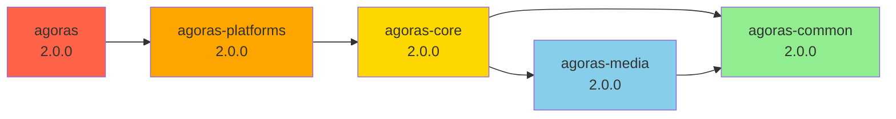

# Week 1, Day 1 Completion Summary

**Status**: ✅ All tasks completed
**Date**: January 10, 2026
**Branch**: develop

## Objectives Achieved

Week 1, Day 1 focused on completing the monorepo setup with all configuration files, dependencies, and development tooling.

## Deliverables

### Task 1.1: Setup.py Files ✅

Created `setup.py` for all 5 packages with proper metadata and dependencies:

1. **packages/common/setup.py**
   - Package name: `agoras-common`
   - Version: 2.0.0
   - Dependencies: None (pure Python)
   - Description: Common utilities and logging

2. **packages/media/setup.py**
   - Package name: `agoras-media`
   - Version: 2.0.0
   - Dependencies: `agoras-common>=2.0.0`, filetype, requests, opencv-python, Pillow
   - Description: Image and video processing

3. **packages/core/setup.py**
   - Package name: `agoras-core`
   - Version: 2.0.0
   - Dependencies: `agoras-common>=2.0.0`, `agoras-media>=2.0.0`, atoma, gspread, google-auth
   - Description: Core interfaces, Feed, Sheet, Base API/Auth

4. **packages/platforms/setup.py**
   - Package name: `agoras-platforms`
   - Version: 2.0.0
   - Dependencies: `agoras-core>=2.0.0`, plus all platform SDKs (tweepy, pyfacebook, discord.py, etc.)
   - Description: Platform-specific implementations

5. **packages/cli/setup.py**
   - Package name: `agoras`
   - Version: 2.0.0
   - Dependencies: `agoras-platforms>=2.0.0`
   - Entry point: `agoras=agoras.cli.main:main`
   - Description: Command-line interface

### Task 1.2: Namespace Packages ✅

Verified namespace package structure:

- ✅ NO `__init__.py` in `src/agoras/` (correct for namespace packages)
- ✅ All packages follow consistent structure
- ✅ Will merge correctly when installed together

### Task 1.3: Git Configuration ✅

1. **packages/.gitignore**: Created with comprehensive ignore patterns
   - Python artifacts (**pycache**, *.pyc)
   - Build artifacts (build/, dist/, *.egg-info)
   - Test artifacts (.tox/, .coverage, htmlcov/)
   - IDE files (.vscode/, .idea/)

2. **Root .gitignore**: Updated with packages-specific patterns
   - `packages/*/build/`
   - `packages/*/dist/`
   - `packages/*/*.egg-info/`
   - `packages/*/.tox/`
   - `packages/*/.coverage`
   - `packages/*/htmlcov/`
   - `*.lcov`

### Task 1.4: Requirements Files ✅

Split dependencies by package:

1. **packages/common/requirements.txt**: Empty (no external dependencies)

2. **packages/media/requirements.txt**:
   - filetype==1.2.0
   - requests==2.32.4
   - opencv-python-headless==4.10.0.84
   - Pillow>=10.0.0

3. **packages/core/requirements.txt**:
   - atoma==0.0.17 (RSS parsing)
   - gspread==6.2.1 (Google Sheets)
   - google-auth==2.40.3
   - python-dateutil==2.9.0.post0

4. **packages/platforms/requirements.txt**:
   - tweepy==4.16.0 (X/Twitter)
   - python-facebook-api==0.20.1 (Facebook)
   - linkedin-api-client==0.3.0 (LinkedIn)
   - beautifulsoup4==4.13.4 (Parsing)
   - discord.py==2.5.0 (Discord)
   - google-api-python-client==2.110.0 (YouTube)
   - google-auth-oauthlib==1.1.0
   - google-auth-httplib2==0.1.1
   - oauth2client==4.1.3
   - platformdirs==4.3.6
   - authlib==1.6.0 (OAuth)
   - threadspipepy>=0.4.5 (Threads)
   - cryptography>=42.0.0
   - python-telegram-bot>=22.1 (Telegram)

5. **packages/cli/requirements.txt**: Empty (inherits from platforms)

### Task 1.5: Testing Configuration ✅

1. **packages/pytest.ini**: Created with:
   - Test path configuration
   - Async mode enabled
   - Verbose output
   - Warning filters

2. **packages/.coveragerc**: Created with:
   - Source configuration
   - Omit patterns (tests, pycache, site-packages)
   - Exclude lines (pragma, abstract methods)
   - HTML and LCOV report configuration

### Task 1.6: Documentation ✅

1. **packages/CONTRIBUTING.md**: Comprehensive development guide
   - Development setup instructions
   - Install packages in editable mode
   - Running tests (single package and all packages)
   - Building packages
   - Code style guidelines
   - Common tasks (adding platforms, utilities)
   - Troubleshooting

2. **CONTRIBUTING.rst**: Updated with monorepo section
   - Added "Monorepo Development (v2.0)" section
   - Installation instructions for all packages
   - Testing guidelines
   - Reference to detailed guide

## File Summary

### Created Files (26 total)

**Setup Files (5)**:

- `packages/common/setup.py`
- `packages/media/setup.py`
- `packages/core/setup.py`
- `packages/platforms/setup.py`
- `packages/cli/setup.py`

**Requirements Files (5)**:

- `packages/common/requirements.txt`
- `packages/media/requirements.txt`
- `packages/core/requirements.txt`
- `packages/platforms/requirements.txt`
- `packages/cli/requirements.txt`

**Configuration Files (4)**:

- `packages/.gitignore`
- `packages/pytest.ini`
- `packages/.coveragerc`
- Updated `.gitignore`

**Documentation (2)**:

- `packages/CONTRIBUTING.md`
- Updated `CONTRIBUTING.rst`

**README Files (5)** (from Week 0):

- `packages/README.md`
- `packages/common/README.md`
- `packages/media/README.md`
- `packages/core/README.md`
- `packages/platforms/README.md`
- `packages/cli/README.md`

**From Week 0 (5)**:

- `packages/tox.ini`
- `packages/dev-requirements.txt`

## Dependency Chain Verification



## Testing the Setup

### Verify Package Structure

```bash
cd packages
for pkg in common media core platforms cli; do
    echo "=== $pkg ==="
    ls -la $pkg/
    echo
done
```

### Test Installation Order

```bash
# In a fresh virtualenv:
pip install -e packages/common/
pip install -e packages/media/
pip install -e packages/core/
pip install -e packages/platforms/
pip install -e packages/cli/
```

### Verify Namespace Packages

```bash
# Should show NO __init__.py in src/agoras/
find packages/*/src/agoras -maxdepth 0 -name "__init__.py"
# (should return nothing)
```

## Success Criteria Met

All Day 1 success criteria achieved:

1. ✅ `setup.py` files for all 5 packages with correct dependencies
2. ✅ Namespace package structure configured correctly
3. ✅ Git configured to track packages/ properly
4. ✅ Requirements files split by package
5. ✅ Testing configuration (pytest.ini, .coveragerc)
6. ✅ Development documentation updated

## Known Issues

None. All tasks completed successfully.

## Next Steps

**Week 1, Day 2**: Begin actual code extraction with `agoras-common`.

Day 2 will:

1. Extract `agoras/core/utils.py` to `packages/common/src/agoras/common/utils.py`
2. Extract `agoras/core/logger.py` to `packages/common/src/agoras/common/logger.py`
3. Extract `agoras/__init__.py` metadata to `packages/common/src/agoras/common/version.py`
4. Create `packages/common/src/agoras/common/__init__.py`
5. Write unit tests for common package
6. Verify standalone functionality

## Notes

- All configuration files use consistent metadata (author, email, GPL v3 license)
- Version numbers are synchronized at 2.0.0 across all packages
- Dependencies are properly chained to ensure correct installation order
- Development tools are configured for both individual and collective testing
- Documentation provides clear guidance for contributors

**Status**: Ready to begin code extraction on Day 2.
